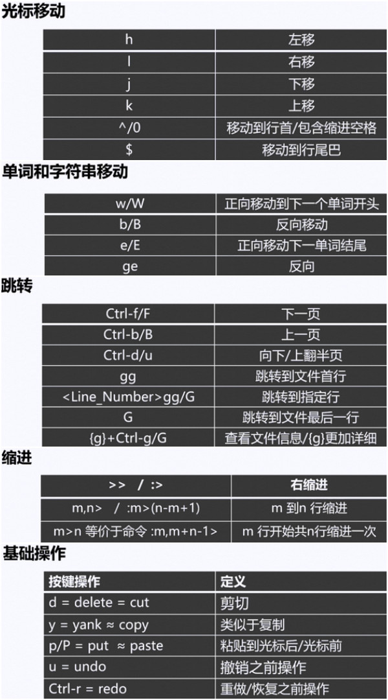
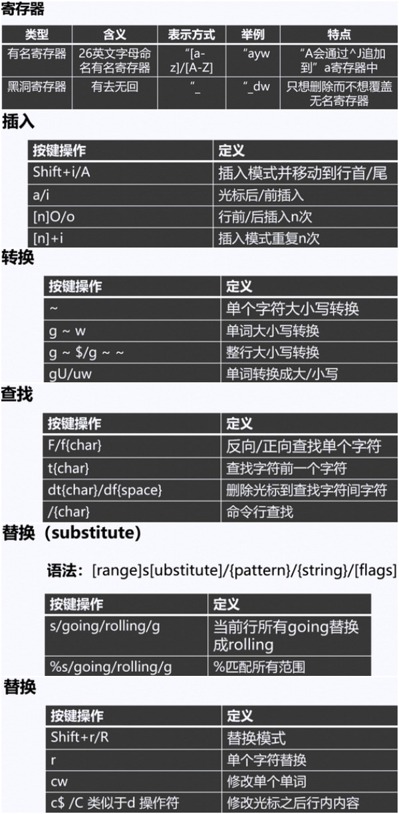
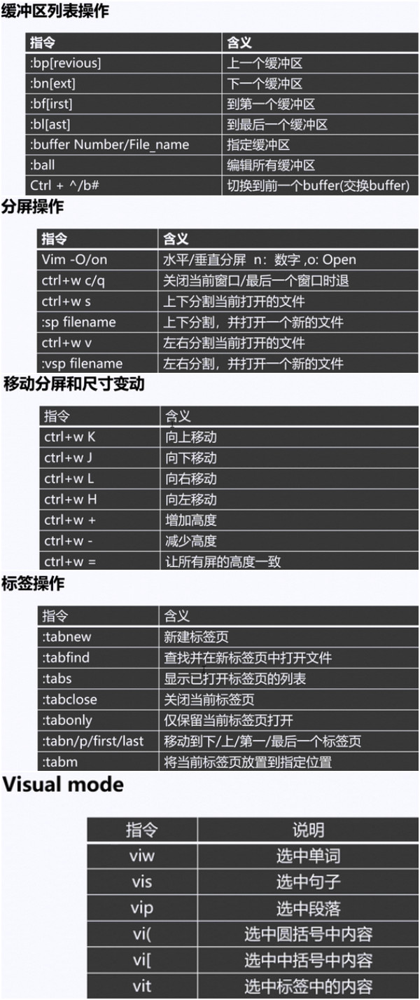
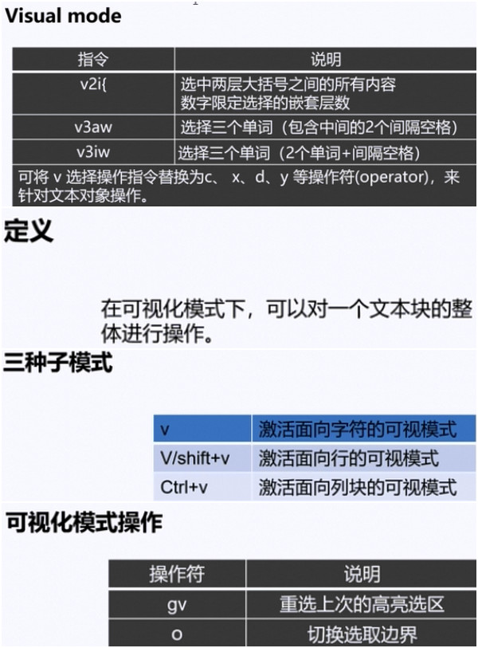

## Vim
## 前言，Vim更多的是一种技能，而非一种知识；它的学习更多是是双手去实践而不是头脑中思考，相对的学习任何编程类语言估计都是相似的吧。

###移动光标：
    + h--左  ✔      
    + j--下  ✔  
    + k--上  ✔   // 9k 向上移动9行   
    + l--右  ✔

    + w--向前移动一个word     // 3w  ✔
    + b--向后移动一个word     // backword  ✔
    + e--移动到下一个word的最后一个字符  // end of word  ✔
    + ge--移动到前一个word的最后一个字符上  
    + W--空白为分界的WORDs为单位进行移动  
    + gg--移动到文件头  ✔
    + G--移动到文件尾  ✔

    + $--移动到当前行行尾   // 2$  ✔
    + 0--移动到当前行的第一个字符上 ✔  
    + ^--移动到当前行的第一个非空白字符上  
    + :n--指定到第n行  ✔  

    + fx--单字符搜索命令   // 3fh ✔  
###删除单个字符：
    + x     // 3x 删除3个字符 ✔  
###删除一整行内容：
    + dd  ✔  
        - :n1,n2d  
    + p 粘贴到光标后  
    + P 粘贴到光标前  
###撤销和重做：
    + u--撤销最后一次删除  ✔
    + U--一次撤消对一行的全部操
    + Ctrl-R--反转撤销
###编辑命令：
    + i--在当前光标之前插入文本
    + a--在光标之后插入文本  // 3a! 在行尾追加3个!
    + o--在当前行的下面另起一行  
    + O--在当前行的上面另起一行     
####退出：
    + ZZ--保存文件并退出Vim   
####帮助命令    :help command
####查找/替换：
    + /string--搜索一个字符串  
    + :1,10s/old/new/g 
        - :1,10s/^/#/g
        - :1,10s/^#//g
        - :%s/old/new/g
    
    
    
  
 