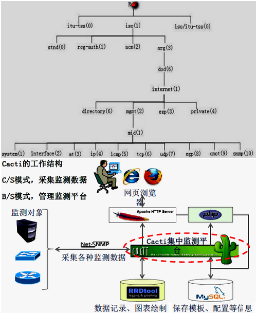
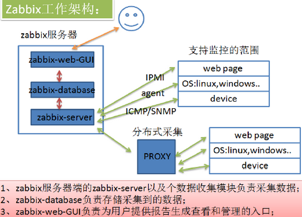

## 监控服务 
### 1. 常见的监控平台
#### 1.1 Cacti 流量与性能监测为主 [Cacti](http://www.cacti.net)  
+ **展示平台 Apache**：B/S
+ **收集数据**：SNMP(Simple Network Management Protocol)
+ **RRD Tool** 绘图软件  
#### 1.2 Nagios 服务与性能检测为主 [Nagios](http://www.nagios.org)  
+ **展示平台**：B/S
+ **收集数据**：C/S (脚本)
+ ntop
#### 1.3 Zabbix 新型全功能监控软件 [Zabbix](http://www.zabbix.com)  
+ **展示平台**：B/S
+ **收集数据**：C/S (脚本)、SNMP
### 2. Cacti 监控平台  

#### 2.1 Cacti 原理
> **SNMP(收集数据)** -->**RRD Tool(绘图)** -->**Apache(平台展示)**
#### 2.2 Cacti 监控构建
`[root@xy ~]# yum -y install httpd mysql mysql-server mysql-devel libxml2-devel mysql-connector-odbc perl-DBD-MySQL unixODBC php php-mysql php-pdo`  

`[root@xy ~]# yum -y install net-snmp net-snmp-utils net-snmp-libs lm_sensors`  服务器端  10.10.10.11  安装 snmp

`[root@xy ~]# mount -o loop cacti.iso /mnt/iso`  
`[root@xy ~]# cp -a /mnt/iso/* .`    
`[root@xy ~]# tar -xzvf rrdtool-1.4.5.tar.gz`  安装 rrdtool  
`[root@xy ~]# ./configure --prefix=/usr/local`  
`[root@xy ~]# make && make install`  
    
    报错解决方法：
        tar -xzvf cgilib-0.5.tar.gz
        cd cgilib-0.5/
        make  
        cp libcgi.a /usr/local/lib
        cp cgi.h /usr/local/include
`[root@xy ~]# yum -y install libart_lgpl-devel pango-devel* cairo-devel*`  

`[root@xy ~]# tar -xzvf cacti-0.8.7g.tar.gz`  
`[root@xy ~]# mv cacti-0.8.7g/ /var/www/html/`  
`[root@xy ~]# patch -p1 -N < ~/cacti/data_source_deactivate.patch`  打补丁  
`[root@xy ~]# useradd runct`  
`[root@xy cacti]# chown -R root:root ./`  
`[root@xy cacti]# chown -R runct:runct rra/ log/`    
`[root@xy cacti]# mysql -uroot -p`  授权数据库用户，导入初始化数据  

    mysql> create database cactidb default character set utf-8;
    mysql> grant all privileges on cactidb.* to cactiuser@localhost identified by 'pwd@123';
    mysql> quit
`[root@xy cacti]# mysql -uroot -p cactidb < cacti.sql`  
`[root@xy cacti]# vim /include/config.php`  设置数据连接参数   
/* make sure these values refect your actual database/host/user/password */
`[root@xy cacti]# vim /etc/httpd/conf/httpd.conf`   
DocumentRoot "/var/www/html/cacti"  
<Directory "/var/www/html/cacti">  
DirectoryIndex index.php index.html index.htm.var  
#### 2.3 Cacti 插件添加 
`[root@xy ~]# yum -y install net-snmp net-snmp-utils net-snmp-libs lm_sensors`  10.10.10.12  客户端  
`[root@xy ~]# service snmpd start`  
`[root@xy ~]# snmpwalk -v 2c -c public 10.10.10.11 tcp`  -c 共同体名称(组号)  

    V1 版 简单，高效，不支持加密及身份认证  
    V2 版 身份认证  
    V3 版 加密  
`[root@xy ~]# vim /etc/snmpd.conf`  

    view all include .1  
    #       group   context sec.model   sec.level   prefix  read        write   notif   
    access  notConfigGroup  ""  any noauth          exact   all  none    none  
`[root@xy ~]# su -runct`  
`[runct@xy ~]# php /var/www/html/cacti/poller.php`  
`[runct@xy ~]# crontab -e`  
`*/5   *   *   *   *   /usr/bin/php    /var/www/html/cacti/poller.php &>/dev/null`   min hour day month week  

`[root@xy cacti-plugin]#  tar -xzvf cacti-plugin-0.8.7-PA-v2.8.tar.gz`  
`[root@xy cacti-plugin-arch]# mysql -uroot -p cactidb < pa.aql`  
### 2. Nagios 监控平台  
#### 2.1 Nagios 原理

#### 2.2 Nagios 构建
`[root@xy ~]# yum -y install httpd gcc glibc glibc-commom php php-mysql`  在光盘里找 *gd* 安装  
`[root@xy ~]# groupadd nagcmd`  
`[root@xy ~]# useradd -m nagios`  
`[root@xy ~]# usermod -a -G nagcmd nagios`  
`[root@xy ~]# usermod -a -G nagcmd apache`  
`[root@xy ~]# mount -o loop nagios.iso /mnt/iso`  
`[root@xy ~]# cp -a /mnt/iso/* .`  
`[root@xy ~]# tar -xzvf nagios-3.1.2.tar.gz`  
`[root@xy nagios-3.1.2]# ./configure --with-command-group=nagcmd --enable-event-broker`   
`[root@xy nagios-3.1.2]# make all`  
`[root@xy nagios-3.1.2]# make install`  
`[root@xy nagios-3.1.2]# make install-init`  
`[root@xy nagios-3.1.2]# make install-config`  
`[root@xy nagios-3.1.2]# make install-commandmode`  
`[root@xy nagios-3.1.2]# vim /usr/local/nagios/etc/objects/contacts.cfg`  
email   nagios@localhost  
`[root@xy nagios-3.1.2]# make install-webconf`  
`[root@xy nagios-3.1.2]# vim /etc/httpd/conf.d/nagios.conf`  
 `[root@xy nagios-3.1.2]# htpasswd -c /usr/local/nagios/etc/htpasswd.users nagiosadmin`  
`[root@xy ~]# tar -xzvf nagios-plugins-1.4.15.tar.gz`  
`[root@xy nagios-plugins-1.4.15]# ./configure --with-nagios-user=nagios --with-nagios-group=nagios --with-mysql --enable-perl-modules`  
`[root@xy nagios-plugins-1.4.15]# make &&  make install`  
`[root@xy nagios-plugins-1.4.15]# chkconfig --add nagios`  
`[root@xy nagios-plugins-1.4.15]# chkconfig nagios on`  
`[root@xy nagios-plugins-1.4.15]# /usr/local/nagios -v /usr/local/nagios/etc/nagios.cfg`  
`[root@xy nagios-plugins-1.4.15]# service nagios start`  
#### 2.3 Nagios 添加监控主机
### 3. Zabbix 监控平台  
#### 3.1 Zabbix 组件说明

> 3.1.1 Zabbix 是一个基于WEB界面的提供**分布式系统监视**以及**网络监视功能**的企业级的开源解决方案（基于GPL V2）  
3.1.2 Zabbix 由 2 部分构成，**zabbix Server** 与可选组件 **zabbix agent**

+ Zabbix 安装完后产生 5 个程序：
    - `zabbix_agentd`：**客户端守护进程，收集客户端数据** ✔
    - `zabbix_get`：Zabbix 工具，单独使用的命令，用于拍错  
    - `zabbix_proxy`：代理守护进程，功能上类似 server，充当中转站的角色
    - `zabbix_sender`：用于发送数据给 server 或者 proxy，在脚本完成后使用sender主动将数据提交   
    - `zabbix_server`：**Zabbix 服务端守护进程**，所有数据都是被提交 或者 主动提交 给 Zabbix_server 端 ✔
    - `zabbix_java_gateway`：类似于agentd，但只用于Java方面，只能主动获取数据，不能被动获取，最终提交给 serve / proxy
#### 3.2 Zabbix 监控构建
`[root@xy ~]# systemctl stop firewalld`  
`[root@xy ~]# systemctl disable firewalld`  
`[root@xy ~]# setenforce 0`  
`[root@xy ~]# sed -i "s/SELINUX=enforcing/SELINUX=disabled/g" /etc/selinux/config`  

`[root@xy ~]# yum -y install mariadb mariadb-server httpd php php-mysql`  
`[root@xy ~]# systemctl enable httpd`  
`[root@xy ~]# systemctl restart httpd`  
`[root@xy ~]# systemctl enable mariadb`  
`[root@xy ~]# systemctl restart mariadb`  
`[root@xy ~]# mysql_secure_installation`  

`[root@xy ~]# rpm -ivh https://repo.zabbix.com/zabbix/3.0/rhel/7/x86_64/zabbix-release-3.2.1.el7.noarch.rpm`  
`[root@xy ~]# rpm --import /etc/pki/rpm-gpg/RPM-GPG-KEY-ZABBIX`  
`[root@xy ~]# yum -y install zabbix-server-mysql zabbix-web-mysql zabbix-agent`  
`[root@xy ~]# mysql -uroot -p`  
`MariaDB [(none)]> create database zabbix default character set utf8 collate utf8_bin;`  
`MariaDB [(none)]> grant all privileges on zabbix.* to zabbix@localhost identified by 'zabbix';`  
`[root@xy ~]# cd /usr/share/doc/zabbix-server-mysql-3.2.11/`  
`[root@xy zabbix-server-mysql-3.2.11]# zcat create.sql.gz | mysql -uroot -p zabbix`  
`[root@xy zabbix-server-mysql-3.2.11]# vim /etc/zabbix/zabbix_server.conf`  ✔
DBHost=localhost  
DBName=zabbix  
DBUser=zabbix  
DBPassword=zabbix  
`[root@xy zabbix-server-mysql-3.2.11]# systemctl start zabbix-server`  
`[root@xy zabbix-server-mysql-3.2.11]# systemctl enable zabbix-server`  
`[root@xy zabbix-server-mysql-3.2.11]# vim /etc/httpd/conf.d/zabbix.conf`  
php_value date.timezone Asia/Shanghai  
`[root@xy ~]# systemctl restart httpd`  
`[root@xy ~]# yum -y install ntpdate`  
`[root@xy ~]# /usr/share/zabbix`  
`[root@xy ~]# vim /etc/zabbix/zabbix_agentd.conf`  ✔
`[root@xy ~]# systemctl start zabbix-agent`    
`[root@xy ~]# systemctl enable zabbix-agent`  
`[root@xy ~]# netstat -anpt | grep :10050`  
`[root@xy ~]# mv simsun.ttc /usr/share/zabbix/fonts`  
`[root@xy fonts]# chomod a+x song.ttf`  
 `[root@xy fonts]# vim /usr/share/zabbix/include/defines.inc.php`  :font  ✔  
#### 3.3 Zabbix 手动添加监控主机 / 自动发现  10.10.10.12
`[root@xy ~]# yum -y install zabbix-agent-3.2.1-1.el6.x86_64.rpm`  
`[root@xy ~]# service httpd start`  
`[root@xy ~]# echo "Hello,HTML~" >> /var/www/html/index.html`  
`[root@xy ~]# curl localhost`  
`[root@xy ~]# vim /etc/zabbix/zabbix_agentd.conf`   
Server=10.10.10.11  
ServerActive=10.10.10.11  
Hostname=10.10.10.12  
`[root@xy ~]# service zabbix-agent start`  
`[root@xy ~]# chkconfig zabbix-agent on`   
`[root@xy ~]# netstat -anpt | grep :10050`   

`[root@xy ~]# yum -y install zabbix-agent-3.2.1-1.el6.x86_64.rpm`  10.10.10.13  
`[root@xy ~]# vim /etc/zabbix/zabbix_agentd.conf`   
Server=10.10.10.11  
ServerActive=10.10.10.11  
Hostname=10.10.10.13  
#### 3.4 Zabbix Nginx 并发监控  10.10.10.12
`[root@xy nginx-1.2.6]# yum -y install pcre pcre-devel zlib zlib-devel`  
`[root@xy nginx-1.2.6]# ./configure --help | grep status`  
`[root@xy nginx-1.2.6]# useradd -s /sbin/nologin -M nginx`  
`[root@xy nginx-1.2.6]# ./configure --prefix=/usr/local/nginx --user=nginx --group=nginx --with-htttp_stub_status_module`  
`[root@xy nginx-1.2.6]# make && make install`  
`[root@xy nginx-1.2.6]# echo "123" >> /usr/local/nginx/html/index.html`  
`[root@xy nginx-1.2.6]# /usr/local/nginx/sbin/nginx`  
`[root@xy nginx-1.2.6]# vim /usr/local/nginx/conf/nginx.conf`  

    location    /nginx-status {
        stub_status on;
    }
`[root@xy nginx-1.2.6]# /usr/local/nginx/sbin/nginx -t`  
`[root@xy nginx-1.2.6]# kill -HUP $(/usr/local/nginx/logs/nginx.pid)`  

    #!/bin/bash
    # nginx_status.sh
    # Active connections: 3
    # server accepts handle requests
    #   4   4   5
    # Reading: 1  Writing: 1  Waiting: 1  

    HOST="10.10.10.12"
    PORT="80"
    # 检测 nginx 进程是否存在  
    function ping {
        /sbin/pidof nginx | wc -l
    }
    # 检测 nginx 性能
    function active {
        /usr/bin/curl "http://$HOST:$PORT/ngx_status" 2>/dev/null | grep 'Active' | awk '{print $NF}'
    }
    function reading {
        /usr/bin/curl "http://$HOST:$PORT/ngx_status" 2>/dev/null | grep 'Reading' | awk '{print $2}'
    }
    function writing {
        /usr/local/curl "http://$HOST:$PORT/ngx_status" 2>/dev/null | grep 'Writing' | awk '{print $4}'
    }
    function waiting {
        /usr/local/curl "http://$HOST:$PORT/ngx_status" 2>/dev/null | grep 'waiting' | awk '{print $6}'
    }
    function accepts {
        /usr/local/curl "http://$HOST:$PORT/ngx_status" 2>/dev/null | awk NR==3 | awk '{print $1}'
    }
    function handle {
        /usr/local/curl "http://$HOST:$PORT/ngx_status" 2>/dev/null | awk NR==3 | awk '{print $2}'
    }
    function requests {
        /usr/local/curl "http://$HOST:$PORT/ngx_status" 2>/dev/null | awk NR==3 | awk '{print $3}'
    }    
    # 执行 function 
    $1

    %s/ngx_status/nginx_status/g
`[root@xy nginx-1.2.6]# chmod a+x nginx-status.sh`  
`[root@xy ~]# vim /etc/zabbix/zabbix_agentd.conf`  ✔
UnsafeUserParameter=1  
UserParameter=nginx.status[*],/etc/zabbix/zabbix_agentd.d/nginx-status.sh $1  
`[root@xy ~]# yum -y install zabbix-get`   10.10.10.11 
`[root@xy ~]# zabbix_get -s 10.10.10.12 -k 'nginx.status[requests]'`   
#### 3.5 Zabbix Web场景、组合图

#### 3.6 Zabbix 报警设置

