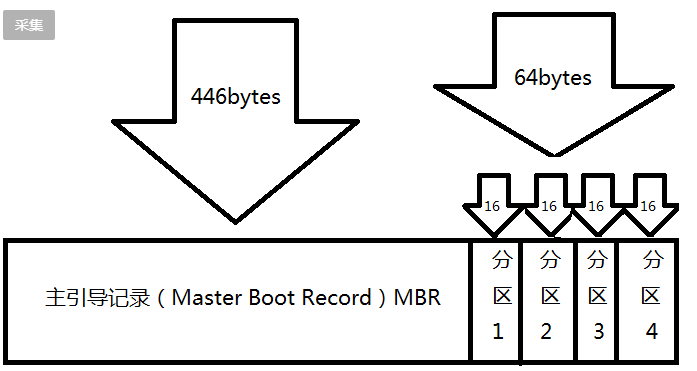
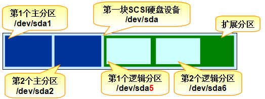
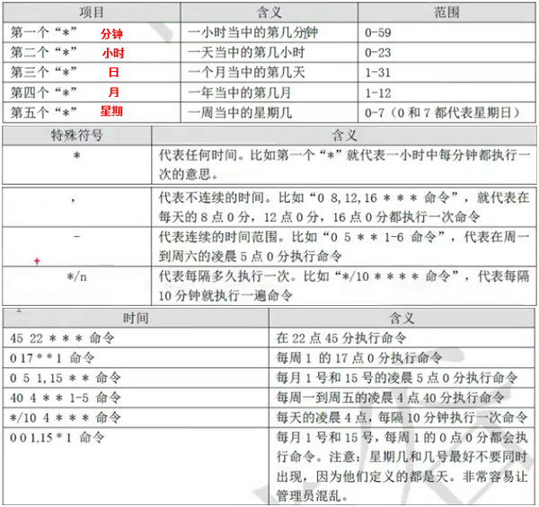

199 238 106
## 目录 

* [首扇区知识](#首扇区)
* [RPM](#RPM)
* [Yum](#Yum)
* [启动模式](#启动模式)
* [管理服务](#管理服务)
* [查看进程IDpidof](#pidof)
* [杀死进程IDkill](#lill) 
* [杀死进程服务killall](#killall)
* [打包压缩与搜索命令](#tar)
* [重定向操作](#重定向)
* [配置yum库](#yum库)
* [Shell脚本](#Shell)
* [crontab](#j计划服务)
## 分区方案：
### 背景知识：  
1. 硬盘建立分区遵从：主分区 -- 扩展分区 -- 逻辑分区 -- 激活主分区 -- 格式化所有分区；虚拟机的三种网络模式：**桥接网络**，**NAT网络地址转换(VMnet8)**，**仅主机模式(VMnet1)**；其中，主机模式仅仅与物理主机通信，不能访问外网，而其它两种可以通过物理主机进行外网的访问。

2. 主引导记录 MBR（Master Boot Record）：

3. 硬盘由大量扇区构成，以首扇区最重要，**首扇区共512B**，**结束符占2B**，**主引导记录占446B**，所以**分区表就只有64B**，分区表记录一个分区信息需要16B，所以做多记录4个分区信息，为了解决分区不够的问题，可将其中的分区信息指向另外一个分区，称为**扩展分区**，在扩展分区里划分逻辑分区，**一块硬盘只能有一个扩展分区，1、2、3、4号只能给主分区，5、6开始为逻辑分区**。   
      
    

### Linux 下的分区方案
	1. /：　用于存放系统，划为主分区
	2. /boot：　引导分区，划为主分区，大概200M即可；
	3. /swap：　充当虚拟内存，划为逻辑分区，大致为电脑内存；
	4. /home：　划为逻辑分区，用于存放用户文件；
	5. /tmp：　存放临时文件，可有可无，划为逻辑分区；

### RPM:(红帽软件包管理器) 相当于windows 的控制面板的软件管理 

    rpm -ivh filename.rpm　　安装软件  ✔
    rpm -e filename.rpm　　　卸载软件 ✔
    
    rpm -Uvh filename.rpm　　升级软件   
    rpm -qpi filename.rpm　　查询软件描述信息
    rpm -qpl filename.rpm　　列出软件文件信息 
    rpm -qf filename　　　　 查询文件属于哪个RPM的命令格式
    rpm -qa | grep filename　查询所安装的软件的名称    ✔

### Yum软件仓库: 

    yum repolist all　　　　　  列出软件仓库  ✔
    yum list all　　　　　　　   列出仓库所有软件 ✔

    yum info 软件包名称　　　　  查看软件包信息  ✔
    yum install 软件包名称　　   安装软件包 ✔
    yum reinstall 软件包名称　　 卸载软件包  ✔
 
    yum update 软件包名称　　　	升级软件包  ✔
    yum remove 软件包名称　　　　移除软件包 ✔
 
    yum clean all　　　　　　　  清除所有仓库缓存 ✔
    yum check-update　　　　　 　检查可更新的软件包  ✔

    yum grouplist　　　　　　　　查看系统中已经安装的软件包组  
    yum groupinstall 软件包组　　 安装指定的软件包组  
    yum groupremove 软件包组　　　移除指定的软件包组 
    yum groupinfo 软件包组　　　　查询指定的软件包组信息 

### BIOS--Boot Loader--内核--内核初始化--启动初始化进程(systemd) ✔

### 1. 启用多用户、无图形模式   

`[root@xy ~]# ln -sf /lib/systemd/system/multi-user.target /etc/systemd/system/default.target` 

### 2. 启用多用户、图形模式  
`[root@xy ~]# ln -sf /lib/systemd/system/graphical.target /etc/systemd/system/default.target`

### 3. 管理服务  

**System V init** 　　		**systemctl**  

    service foo start   		systemctl start foo.service
    service foo restart 		systemctl restart foo.service
    service foo stop   		    systemctl stop foo.service   
    service foo reload  		systemctl reload foo.service   
    service foo status  		systemctl status foo.service
    　　　　　　　　　　 		    journalctl -xe	

### 4. 设置服务开机启动、不启动  

**System V init**　　		**systemctl**    
    
    chkconfig foo on   		systemctl enable foo.service
    chkconfig foo off  		systemctl disable foo.service  
    chkconfig foo list 		systemctl list-unit-files --type=service    

### 5. 重置密码操作
`cat /etc/redhat-release`  　　**查看redhat-realease version**
*linux16 追加 rd.break ctrl+x运行*  
`mount -o remount, rw /sysroot`  
`chroot /sysroot`  
`passwd`  
`touch /.autorelable`  
`exit`  
`reboot` 
 
### 6. 解决piix4_smbus 0000:00:007:3:Host SMBus controller not enabled!  
`[root@xy Desktop]# lsmod | grep i2c`　　 **搜索模块**  
i2c_piix4              22106  0   
i2c_core               40325  2 drm,i2c_piix4  
`[root@xy Desktop]# vim /etc/modprobe.d/blacklist.conf`    
加入 `blacklist i2c-piix4` 　　　　 **加黑名单**  
`reboot`

### 7. 常用系统工作命令
#### 7.1 man  
Last login: Thu Jul  5 22:34:40 EDT 2018 on :0  
`[root@xy ~]# man man` 　　**帮助**

#### 7.2 echo  　　**字符串 / $变量**  
`[root@xy ~]# echo xy`  
xy  
`[root@xy ~]# echo $SHELL`  
/bin/bash

#### 7.3 date  
    %t 跳格               %H 小时(00~23)
    %S 秒(00~59)         %I 小时(00~12)
    %M 分钟(00~59)        %J 今年中的第几天  
`[root@xy ~]# date`  
Thu Jul  5 22:44:59 EDT 2018  
`[root@xy ~]# date "+%Y-%M-%m-%d %H:%M:%S"`  
2018-45-07-05 22:45:56  
`[root@xy ~]# date -s "20180706 10:49:00"`   
Fri Jul  6 10:49:00 EDT 2018  
`[root@xy ~]# date`  
Fri Jul  6 10:49:07 EDT 2018  
`[root@xy ~]# date "+%j"`  
187         
`[root@xy ~]# reboot`   
`[root@xy ~]# poweroff`  

#### 7.4 wget  
    -b 后台下载         -P 下载至指定目录
    -t 最大尝试次数      -c 断点续传
    -p 下载页面搜有资源   -r 递归下载        
`[root@xy ~]# wget -r -p htpp://www.linuxprobe.com`

#### 7.5 ps  
    -a 显示搜有进程　　-u 用户以及其他详细信息　　-x 显示没有控制终端进程  
`[root@xy ~]# ps -aux`  
USER        PID %CPU %MEM    VSZ   RSS TTY      STAT START   TIME COMMAND  
root          1  0.8  0.3  53784  7716 ?        Ss   10:37   0:09 /usr/lib/  systetemd    
root          2  0.0  0.0      0     0 ?        S    10:37   0:00 [kthreadd]    
root          3  0.0  0.0      0     0 ?        S    10:37   0:00 [ksoftirqd/0]    
root          8  0.0  0.0      0     0 ?        S    10:37   0:00 [rcu_bh]    
root       3040  0.0  0.0      0     0 ?        R    10:55   0:00 [kworker/1:1]    
root       3041  0.0  0.0 125440  1436 pts/0    R+   10:55   0:00 ps -aux   
.......省略部分信息........    
**5种常见进程状态:R(运行) S(中断) D(不可中断) Z(僵死) T(停止)**

#### 7.6 top  
`[root@xy ~]# top`     **动态显示进程活动**  
top - 11:00:06 up 23 min,  2 users,  load average: 0.96, 0.59, 0.53
Tasks: 486 total,   1 running, 485 sleeping,   0 stopped,   0 zombie
%Cpu(s): 21.9 us, 11.8 sy,  0.0 ni, 66.3 id,  0.0 wa,  0.0 hi,  0.0 si,  0.0 st
KiB Mem:   2035648 total,  1280152 used,   755496 free,     1084 buffers
KiB Swap:  2113532 total,        0 used,  2113532 free.   342864 cached Mem

   PID USER      PR  NI    VIRT    RES    SHR S  %CPU %MEM     TIME+ COMMAND        
  2266 xy        20   0 2080232 556564  39044 S  58.9 27.3   7:42.19 gnome-shell    
  1152 root      20   0  200308  30496   7664 S  26.2  1.5   1:44.38 Xorg             
  2763 xy        20   0  771480  19072  12532 R  10.5  0.9   0:22.98 gnome-termina+   
  3076 root      20   0  123924   1924   1148 R   1.6  0.1   0:01.40 top      
  1023 root      20   0  191328   3932   3128 S   0.3  0.2   0:09.84 vmtoolsd         
  2445 xy        20   0  346176  16268  13060 S   0.3  0.8   0:09.79 vmtoolsd   
.......省略部分信息........    

#### 7.7 pidof 　　　  

`[root@xy ~]# pidof sshd`　　　**查询PID值 ，pidof 服务名称**  
1552

#### 7.8 kill  

[root@xy ~]# kill 2156	　　**kill PID号**

#### 7.9 killall   

`[root@xy ~]# pidof httpd`  
13581 13580 13579 13578 13577 13576  
`[root@xy ~]# killall httpd`    	　　**killall 服务名称**  
`[root@xy ~]# pidof httpd`   

### 8. 系统状态检测命令  
#### 8.1 ifconfig  
`[root@xy ~]# ifconfig`  
eno16777736: flags=4163<UP,BROADCAST,RUNNING,MULTICAST>  mtu 1500
        ether 00:0c:29:11:26:05  txqueuelen 1000  (Ethernet)  
        RX packets 496  bytes 46407 (45.3 KiB)  
        RX errors 0  dropped 0  overruns 0  frame 0  
        TX packets 0  bytes 0 (0.0 B)  
        TX errors 0  dropped 0 overruns 0  carrier 0  collisions 0  

lo: flags=73<UP,LOOPBACK,RUNNING>  mtu 65536  
        inet 127.0.0.1  netmask 255.0.0.0  
        inet6 ::1  prefixlen 128  scopeid 0x10<host>  
        loop  txqueuelen 0  (Local Loopback)  
        RX packets 770  bytes 62348 (60.8 KiB)  
        RX errors 0  dropped 0  overruns 0  frame 0  
        TX packets 770  bytes 62348 (60.8 KiB)   
        TX errors 0  dropped 0 overruns 0  carrier 0  collisions 0    

#### 8.2 uname  
`[root@xy ~]# uname -a` 　　　**查看系统内核与版本信息**    
Linux xy.com 3.10.0-123.el7.x86_64 #1 SMP Mon May 5 11:16:57 EDT 2014 x86_64 x86_64 x86_64 GNU/Linux  
`[root@xy ~]# cat /etc/redhat-release`   　　　 **系统版本详细信息文件路径**   
Red Hat Enterprise Linux Server release 7.0 (Maipo)

#### 8.3 uptime   
`[root@xy ~]# uptime`　　　**5min	 10min	15min	系统负载状况**  
 11:08:55 up 31 min,  2 users,  load average: 0.48, 0.42, 0.46    

#### 8.4. free  
`[root@xy ~]# free -h`       　　　**内存使用情况**    
             total       used       free     shared    buffers     cached  
Mem:          1.9G       1.2G       732M       9.8M       1.1M       335M  
-/+ buffers/cache:       919M       1.0G  
Swap:         2.0G         0B       2.0G  

#### 8.5 who  
`[root@xy ~]# who`      　　　　　**当前登陆主机用户信息**  
xy       :0           2018-07-05 22:38 (:0)  
xy       pts/0        2018-07-06 11:06 (:0)  

#### 8.6 last    
`[root@xy ~]# last`     　　　　 **查看本机登陆记录**  
xy       pts/0        :0               Fri Jul  6 11:06   still logged in     
xy       pts/0        :0               Thu Jul  5 22:41 - 11:06  (12:24)      
xy       :0           :0               Thu Jul  5 22:38   still logged in        
reboot   system boot  3.10.0-123.el7.x Fri Jul  6 06:37 - 11:11  (04:33)  
.......省略部分信息........    

#### 8.7 history  
`[root@xy ~]# history`      　　　**命令使用历史**     
   1  history    
`[root@xy ~]# history -c`   		   　　**clean**    
`[root@xy ~]# cat ~/.bash_history`  
lsmod|grep i2c  
`vim /etc/modprobe.d/blacklist.conf`    
reboot  
lsmod|grep i2c  
.......省略部分信息........  

#### 8.8 sosreport  
`[root@xy ~]# sosreport`    

sosreport (version 3.0)    

This command will collect diagnostic and configuration information from  
this Red Hat Enterprise Linux system and installed applications.  

An archive containing the collected information will be generated in  
/var/tmp and may be provided to a Red Hat support representative.  

  https://access.redhat.com/support/  

.......省略部分信息........  

Your sosreport has been generated and saved in:  
  /var/tmp/sosreport-xy.com-20180706113138.tar.xz  

The checksum is: 3c78d65b97600e4c6d813f9ebbfbfd9c  

Please send this file to your support representative.  

### 9. 工作目录切换命令  
#### 9.1 pwd  
`[root@xy ~]# pwd`          　　**当前所处工作目录**  
/root

#### 9.2 cd  
`[root@xy ~]# cd /etc`  
`[root@xy etc]# cd -`       　　**cd - 返回到上一次所处目录**  
/root  
`[root@xy ~]# cd /etc`  
`[root@xy etc]# cd ~`       　　**进入当前用户的home目录**  
`[root@xy ~]# cd ..`      　　 **cd .. 进入上级目录**  
`[root@xy /]# cd /etc`  
`[root@xy etc]# cd ..`  

#### 9.3 ls                        
    -a 全部文件(包括隐藏文件) -l 查看文件属性、大小等详细信息   
    -d 查看目录属性信息  -Z 查看安全上下文
`[root@xy ~]# ls -al`    
total 64  
dr-xr-x---. 14 root root 4096 Jul  6 11:06 .  
drwxr-xr-x. 17 root root 4096 Jul  6 06:37 ..  
-rw-------.  1 root root 1024 Jul  6 05:36 anaconda-ks.cfg  
-rw-------.  1 root root  378 Jul  6 11:06 .bash_history  
-rw-r--r--.  1 root root   18 Dec 28  2013 .bash_logout  
drwx------. 10 root root 4096 Jul  5 22:20 .cache  
drwx------. 15 root root 4096 Jul  5 22:09 .config  
.......省略部分信息........  
`[root@xy ~]# ls -ld /etc`    
drwxr-xr-x. 132 root root 8192 Jul  6 06:37 /etc    

### 10. 文本编辑命令  
#### 10.1 cat  
`[root@xy ~]# cat -n initial-setup-ks.cfg`      　　**短篇文本查看 Number**  
   1  #version=RHEL7  
   2  # X Window System configuration information  
   3  xconfig  --startxonboot  
   4  
   5  # License agreement  
   6  eula --agreed  
   7  # System authorization information  
   8  auth --enableshadow --passalgo=sha512  
   9  # Use CDROM installation media  
........省略部分输出信息........

#### 10.2 more  
`[root@xy ~]# more initial-setup-ks.cfg`       　　 **长篇文本查看 翻滚 空格键**  
   1  #version=RHEL7  
   2  # X Window System configuration information  
   3  xconfig  --startxonboot  
   4  	
   5  # License agreement  
   6  eula --agreed  
   7  # System authorization information  
   8  auth --enableshadow --passalgo=sha512  
   9  # Use CDROM installation media  
   10 cdrom  
   11 # Run the Setup Agent on first boot  
   12 firstboot --enable  
........省略部分输出信息........  

#### 10.3 head  
`[root@xy ~]# head -n 10 initial-setup-ks.cfg`      　　**head -n 查看文本前n行**  
1  #version=RHEL7  
2  # X Window System configuration information  
3  xconfig  --startxonboot  
 
5  # License agreement  
6  eula --agreed   
7  # System authorization information  
8  auth --enableshadow --passalgo=sha512  
9  # Use CDROM installation media  
10 cdrom  

#### 10.4 tail  
`[root@xy ~]# tail -n 10 initial-setup-ks.cfg`		　　 **tail -n 查看后10行**  
@guest-agents  
@guest-desktop-agents  
@input-methods  
@internet-browser  
@multimedia  
@print-client  
@x11  
%end  

`[root@xy ~]# tail -f /var/log/messages`			　**tail -f 动态显示log信息**  
Jul  6 11:51:43 xy dbus[1068]: [system] Activating via systemd: service   name='net.reactivated.Fprint' unit='fprintd.service'  
Jul  6 11:51:43 xy systemd: Starting Fingerprint Authentication Daemon...  
Jul  6 11:51:43 xy dbus-daemon: dbus[1068]: [system] Successfully activated   service 'net.reactivated.Fprint'  
Jul  6 11:51:43 xy dbus[1068]: [system] Successfully activated service   'net.reactivated.Fprint'  
Jul  6 11:51:43 xy systemd: Started Fingerprint Authentication Daemon.  
......省略部分信息........  

#### 10.3 diff  
`[root@xy ~]# cat anaconda-ks.cfg`  
1  #version=RHEL7  
2  # System authorization information  
3  auth --enableshadow --passalgo=sha512  

`[root@xy ~]# cat anaconda-ks.cfg | tr [a-z] [A-Z]`  
1  #VERSION=RHEL7  
2  # SYSTEM AUTHORIZATION INFORMATION  
3  AUTH --ENABLESHADOW --PASSALGO=SHA512    

`[root@xy diff]# cat diff_A.txt`  
Welcom to RedHat 7  
RedHat certified  
Free Linux Lessons  
Professional guidance  
Linux Course  

`[root@xy diff]# cat diff_B.txt`   
Welcom tooo RedHat7  

RedHat certified  
Free Linux LessonS  
//////////...../////////  
Professional guidance  
Linux Course  
`[root@xy diff]# diff --brief diff_A.txt diff_B.txt`         　　**比较文本差异**  
Files diff_A.txt and diff_B.txt differ  
`[root@xy diff]# diff -c diff_A.txt diff_B.txt`  
*** diff_A.txt	2018-07-06 12:06:35.889958037 -0400  
--- diff_B.txt	2018-07-06 12:10:58.818955667 -0400  
***************  
*** 1,5 ***  
! Welcom to RedHat 7  
  RedHat certified  
! Free Linux Lessons  
  Professional guidance  
  Linux Course  
--- 1,8 ----  
! Welcom tooo RedHat7  
!   
!   
  RedHat certified  
! Free Linux LessonS  
! //////////...../////////  
  Professional guidance  
  Linux Course  

#### 10.4 wc         **统计指定文本的行数、字数、字节数 word count**  
    -l　　只显示行数line　　-w 只显示单词数word　　-c 只显示字节数  
`[root@xy ~]# wc -l /etc/passwd`  
38 /etc/passwd  
`[root@xy ~]# wc -w /etc/passwd`  
66 /etc/passwd  
`[root@xy ~]# wc -c /etc/passwd`  
1902 /etc/passwd  

#### 10.5 stat 
`[root@xy ~]# stat anaconda-ks.cfg` 	　　**查看文件具体存储信息与时间**  
  File: ‘anaconda-ks.cfg’  
  Size: 1071      	Blocks: 8          IO Block: 4096   regular file  
Device: fd00h/64768d	Inode: 68521005    Links: 1  
Access: (0600/-rw-------)  Uid: (    0/    root)   Gid: (    0/    root)  
Context: system_u:object_r:admin_home_t:s0  
Access: 2018-07-06 14:25:45.099882788 -0400  
Modify: 2018-07-06 05:36:00.000000000 -0400  
Change: 2018-07-06 12:21:08.983950168 -0400  
 Birth: -  

#### 10.6 cut   提取列 字符串  不识别空格
    -f  指定列数    -c  按字符提取   -d  分隔符
`[root@xy ~]# head -n 2 /etc/passwd`  

    root:x:0:0:root:/root:/bin/bash  
    bin:x:1:1:bin:/bin:/sbin/nologin  
`[root@xy ~]# cut -d: -f 1 /etc/passwd`      　　 **按列提取文本字符**  
root  
bin  
daemon  
adm  
lp  
sync  
shutdown  
halt  
mail  
operator  
games  
ftp  
nobody  
dbus  
polkitd  
unbound  
colord  
usbmuxd   
avahi  
avahi-autoipd  
libstoragemgmt  
saslauth  
qemu  
rpc  
rpcuser  
nfsnobody  
rtkit  
radvd  
ntp  
chrony  
abrt  
pulse  
gdm  
gnome-initial-setup  
postfix  
sshd  
tcpdump  
xy  

#### 10.7 tr　**替换文本字符串**
`[root@xy ~]# cat anaconda-ks.cfg | tr [a-z] [A-Z]`  

### 11. 文件目录管理命令  
#### 11.1 touch  
    -a 仅仅修改读取时间atime　　-m 仅仅修改修改时间mtime　　　-d 都修改  
`[root@xy ~]# ls -l anaconda-ks.cfg`  
-rw-------. 1 root root 1024 Jul  6 05:36 anaconda-ks.cfg  
`[root@xy ~]# echo "Visit the LinuxProbe.com to learn linux skills" >>anaconda-ks`  
`[root@xy ~]# ls -l anaconda-ks.cfg`  
-rw-------. 1 root root 1071 Jul  6 12:18 anaconda-ks.cfg  
`[root@xy ~]# touch -d "2018-07-06 05:36" anaconda-ks.cfg`   
`[root@xy ~]# ls -l anaconda-ks.cfg`   
-rw-------. 1 root root 1071 Jul  6 05:36 anaconda-ks.cfg    

#### 11.2 mkdir  
`[root@xy ~]# cd /tmp`  
`[root@xy tmp]# mkdir diff`  
`[root@xy tmp]# cd diff`    
`[root@xy diff]# mkdir -p a/b/c/d/e` 　　　**递归创建目录**  
`[root@xy diff]# cd a`  
`[root@xy a]#`  
`[root@xy ~]# touch install.log`  
`[root@xy ~]# ls`  
anaconda-ks.cfg  Documents  initial-setup-ks.cfg  Music     Public     Videos  
Desktop          Downloads  *install.log*           Pictures  Templates  

#### 11.3 cp  
`[root@xy ~]# cp install.log x.log`  
`[root@xy ~]# ls`  
anaconda-ks.cfg  Documents  initial-setup-ks.cfg  Music     Public     Videos  
Desktop          Downloads  *install.log*           Pictures  Templates  *x.log*  

#### 11.4 mv  
`[root@xy ~]# mv install.log linux.log`  
`[root@xy ~]# ls`  
anaconda-ks.cfg  Documents  initial-setup-ks.cfg  Music     Public     Videos  
Desktop          Downloads  *linux.log*            Pictures  Templates  

#### 11.5 rm  
`[root@xy ~]# rm linux.log`  
rm: remove regular empty file ‘diff’? y  
`[root@xy ~]# rm -f linux.log`          
anaconda-ks.cfg  Documents  initial-setup-ks.cfg  Music     Public     Videos  
Desktop          Downloads  Pictures              Templates  
`[root@xy ~]# mkdir diff`  
`[root@xy ~]# cd diff`  
`[root@xy diff]# cd -`  
/root  
`[root@xy ~]# rm -rf diff`         　　 **-rf**  
`[root@xy ~]# ls`  
anaconda-ks.cfg  Documents  initial-setup-ks.cfg  Pictures  Templates  
Desktop          Downloads  Music                 Public    Video  

#### 11.6 dd          　　按照指定大小和个数的数据块复制文件或转换文件  
    if-输入文件名称　　of-输出文件名称　　
    bs-设置块大小　　count-设置复制块的个数  
`[root@xy ~]# dd if=/dev/zero of=10_file bs=10M count=1`  
`[root@xy ~]# dd if=/dev/cdrom of=RHEL-server-7.0-x86_64.iso`  
`[root@xy ~]# file anaconda-ks.cfg`  
anaconda-ks.cfg: ASCII text  

#### 11.7 file  
`[root@xy ~]# file /dev/sda`  
/dev/sda: block special  

### 12. 打包压缩与搜索命令  

#### 12.1 tar  
    -c 创建压缩文档　　       -x 解开压缩文档　　    
    -t 查看压缩包内容　　    -z 用Gzip压缩/解压
    -j 用bzip2压缩/解压　　   -v 显示压缩/解压过程　　
    -f 目标文件名            -p 保留原文件的权限属性    
    -P 使用绝对路径来压缩　　  -C 指定压缩目录  
`[root@xy tmp]# tar -czvf ect.`dtae +"+%Y-%m-%d"`.tar.gz /ect`  
`[root@xy tmp]# tar -czvf diff.tar.gz /diff`  
diff/  
diff/diff_A.txt  
diff/diff_B.txt  
diff/diff_B.txt~  
diff/diff.tar.gz  
`[root@xy diff]# tar -xzvf diff.tar.gz -C /diff`
  
    1、*.tar 用 tar -xvf 解压
    2、*.gz 用 gzip -d或者gunzip 解压
    3、*.tar.gz和*.tgz 用 tar -xzf 解压
    4、*.bz2 用 bzip2 -d或者用bunzip2 解压
    5、*.tar.bz2用tar -xjf 解压
    6、*.Z 用 uncompress 解压
    7、*.tar.Z 用tar -xZf 解压
    8、*.rar 用 unrar e解压
    9、*.zip 用 unzip 解压
[tar相关命令参考](https://www.cnblogs.com/lhm166/articles/6604852.html)  
#### 12.2 grep     　　提取行    字符串搜索常用！！！！  
    -b 将可执行binary当做text搜索　　-c 仅显示找到的行数　　　
    -i 忽略大小写                    -n 显示行号      　
    -v 反向选择，仅列出没有关键词的行  
`[root@xy ~]# grep -n /sbin/nologin /etc/passwd` 
 
    1:bin:x:1:1:bin:/bin:/sbin/nologin  
    2:daemon:x:2:2:daemon:/sbin:/sbin/nologin  
    3:adm:x:3:4:adm:/var/adm:/sbin/nologin  
    4:lp:x:4:7:lp:/var/spool/lpd:/sbin/nologin  
    5:mail:x:8:12:mail:/var/spool/mail:/sbin/nologin  
    6:operator:x:11:0:operator:/root:/sbin/nologin  

#### 12.3 find       　　文件搜索 实用  
    -name 匹配名称　　    -perm 匹配权限　　
    -user 匹配所有者     -group 匹配所有组　　　
    -mtime -n +n 匹配修改内容的时间  
    -atime -n +n 匹配访问文件的时间　　　　
    -exec ... {} ... \;　　　-exec 后可跟进 执行的命令

`[root@xy ~]# find /etc/ -name "host*" -print`     　　**find 查找路径 -参数**  
/etc/avahi/hosts  
/etc/host.conf  
/etc/hosts  
/etc/hosts.allow  
/etc/hosts.deny  
/etc/selinux/targeted/modules/active/modules/hostname.pp  
/etc/hostname  

`[root@xy ~]# find / -perm -4000 -print`      　　**-perm 匹配权限**  
find: ‘/proc/35382’: No such file or directory  
find: ‘/proc/35428/task/35428/fd/6’: No such file or directory  
find: ‘/proc/35428/task/35428/fdinfo/6’: No such file or directory  
find: ‘/proc/35428/fd/6’: No such file or directory  
find: ‘/proc/35428/fdinfo/6’: No such file or directory  
find: ‘/run/user/1000/gvfs’: Permission denied  
/usr/bin/fusermount  
/usr/bin/su  
/usr/bin/chage  
/usr/bin/gpasswd  
/usr/bin/newgrp  
........省略部分信息........  
`[root@xy ~]# find / -user xy -exec cp -a {} /root/findresults/ \;`   
**厉害！！**  -exec ... {} ... \;  

### 13. 重定向操作符 

    >　 >>　 <　 <<      　　尖头在哪哪边为输出  
* 输入重定向 O-I  
    - 命令 <  文件              
    - 命令 << 分界符                        　　 **遇见分界符为止**  
    - 命令 < 文件1 > 文件2　**将文件1作为命令的标准输入并将标准输出到文件2**  
* 输出重定向 I-O**  
    - 命令 >   文件                         　　 **清空原有文件**  
    - 命令 2>  文件         
    - 命令 >>  文件                         　　 **追加到原有文件内容的后面**  
    - 命令 2>> 文件
    - 命令 >>  文件 2>&1 或 命令 &>> 文件   **将标准输出与错误输出共同写到文件**     

`[root@xy ~]# man bash > readme.txt`  
`[root@xy ~]# echo "Welcome to Linuxprobe.Com" > readme.txt`  
`[root@xy ~]# echo "Quality linux learning materials" >> readme.txt`   
`[root@xy ~]# cat readme.txt`   
Welcome to Linuxprobe.Com  
Quality linux learning materials  
`[root@xy ~]# ls -l xxxxxxx`  
ls: cannot access xxxxxxx: No such file or directory  
`[root@xy ~]# ls -l xxxxxxx > readme.txt`   
ls: cannot access xxxxxxx: No such file or directory  
`[root@xy ~]# ls -l  xxxxxxx 2> readme.txt`       　　**2的用法**    
`[root@xy ~]# cat readme.txt`     
ls: cannot access xxxxxxx: No such file or directory  
`[root@xy ~]# wc -l < readme.txt`  
1      
`[root@xy ~]# cat readme.txt | wc -l`    
1  

### 14. 管道符 |  
`[root@xy ~]# grep "/sbin/nologin" /etc/passwd | wc -l`      　　**例子不错**  
33  
`[root@xy ~]# ls -l /etc/ | more`  
total 1396  
drwxr-xr-x.  3 root root       97 Jul  6 05:01 abrt  
-rw-r--r--.  1 root root       16 Jul  6 05:33 adjtime  
-rw-r--r--.  1 root root     1518 Jun  7  2013 aliases  
.......省略部分输出内容.......  

`[root@xy ~]# echo "19937100xy" | passwd --stdin root`  	  
Changing password for user root.  
passwd: all authentication tokens updated successfully.  

### 15. 命令行的通配符  * 、[0-9]、(?)、[abc]  
    *     匹配零个/多个字符　　　　　　　?     匹配单个字符 
    [0-9] 匹配0~9之间的单个数字的字符    [abc] 匹配a、b、c三个字符中个任意一个
`[root@xy ~]# ls -l /dev/sda*`  
brw-rw----. 1 root disk 8, 0 Jul  6  2018 /dev/sda  
brw-rw----. 1 root disk 8, 1 Jul  6  2018 /dev/sda1  
brw-rw----. 1 root disk 8, 2 Jul  6  2018 /dev/sda2  
`[root@xy ~]# ls -l /dev/sda?`  
brw-rw----. 1 root disk 8, 1 Jul  6  2018 /dev/sda1  
brw-rw----. 1 root disk 8, 2 Jul  6  2018 /dev/sda2  
`[root@xy ~]# ls -l /dev/sda[0-9]`  
brw-rw----. 1 root disk 8, 1 Jul  6  2018 /dev/sda1  
brw-rw----. 1 root disk 8, 2 Jul  6  2018 /dev/sda2  
 
### 16. 常用的转义字符
    \  使反斜杠后的一个变量变为单纯的字符串　　　
    ''  转义其中所有的变量为单纯的字符串  　　   
    "" 保留其中的变量属性,不进行转义处理     　
    ``  命令执行后并返回结果　  
`[root@xy ~]# PRICE=5`  
`[root@xy ~]# echo "Price is $PRICE"`        　　**$ 取变量的值**  
Price is 5  
`[root@xy ~]# echo "Price is $$PRICE"`  
Price is 7982PRICE  
`[root@xy ~]# echo "Price is \$$PRICE"`  
Price is $5  
`[root@xy ~]# echo `uname -a``   　　**执行命令返回结果**  
Linux xy.com 3.10.0-123.el7.x86_64 #1 SMP Mon May 5 11:16:57 EDT 2014 x86_64 x86_64 x86_64 GNU/Linux  

### 17. 重要的环境变量  
`[root@xy ~]# touch xy.txt`  
`[root@xy ~]# ls`  
anaconda-ks.cfg  Documents  initial-setup-ks.cfg  Pictures  readme.txt  Videos  
Desktop          Downloads  Music                 Public    Templates   xy.txt  
`[root@xy ~]# rm xy.txt`  
rm: remove regular empty file ‘xy.txt’?  y  
`[root@xy ~]# alias rm`           　　**alias 的用法**  
alias rm='rm -i'                       　　**inter**  
`[root@xy ~]# unalias rm`         　　 **unalias 的用法**  
`[root@xy ~]# rm xy.txt`  

**HOME      SHELL     HISTSIZE    HISTFILESIZE  MAILL**       
**LANG      RANDOM    PS1         PATH          EDITOR**  
   使用 export **变量名** *提升变量为全局变量*  
`[root@xy test]# type -a true`         　　**type 命令名称 内部还是外部**  
true is a shell builtin  
true is /bin/true  
true is /usr/bin/true  
`[root@xy test]# type true`   
true is a shell builtin  
`[root@xy test]# env`			     　　 **env  查看所有的环境变量**   
`[root@xy ~]# echo $PATH`  
/usr/local/bin:/usr/local/sbin:/usr/bin:/usr/sbin:/bin:/sbin   
`[root@xy ~]# PATH=$PATH:/root/bin`         　　**增加PATH**    
`[root@xy ~]# echo $PATH`  
/usr/local/bin:/usr/local/sbin:/usr/bin:/usr/sbin:/bin:/sbin:　　**/root/bin**    

### 18. Vim文本编辑器 ESC  
    :w　　:q　　:q!　　:wq!　　a　　i　　o　　u 撤销上一步操作  

### 19. 配置主机名
`[root@xy ~]# vim /etc/hostname`  
xy.com  
`[root@xy ~]# hostname`  
xy.com  

### 20. 配置网卡信息  
`[root@xy ~]# cd /etc/sysconfig/network-scripts/`  
`[root@xy network-scripts]# ls`  
ifcfg-eno16777736  　ifdown-ppp      　 ifup-eth     ifup-sit    
ifcfg-lo           ifdown-routes    ifup-ippp    ifup-Team  
ifdown             ifdown-sit       ifup-ipv6    ifup-TeamPort  
ifdown-bnep        ifdown-Team      ifup-isdn    ifup-tunnel  
ifdown-eth         ifdown-TeamPort  ifup-plip    ifup-wireless  
ifdown-ippp        ifdown-tunnel    ifup-plusb   init.ipv6-global  
ifdown-ipv6        ifup             ifup-post    network-functions  
ifdown-isdn        ifup-aliases     ifup-ppp     network-functions-ipv6  
ifdown-post        ifup-bnep        ifup-routes  
`[root@xy network-scripts]# vim  ifcfg-eno16777736`  　**RHEL5，6 ifcfg-eth**  
  TYPE=Ethernet  
  BOOTPROTO=static  
  NAME=eno16777736  
  ONBOOT=yes  
  HWADDR=00:0C:29:11:26:05  
  IPADDR0=192.168.37.10  
  PREFIX0=24  
  GATEWAY0=192.168.37.1  
  DNS1=192.168.37.1  
`[root@xy network-scripts]# systemctl restart network`  
`[root@xy network-scripts]# ping 192.168.37.10`  

### 21. 配置Yum软件仓库  

`[root@xy ]# vim /etc/yum.repos.d/rhel7.repo`    　 **创建本地yum源**   
  [rhel-media]  
  name=xy  
  baseurl=file:///media/cdrom　　file:ftp://　　file:http://　　file:///  
  enabled=1   　**启用**         
  gpgcheck=1  
  gpgkey=file:///media/cdrom/RPM-GPG-KEY-redhat-release  

`[root@xy yum.repos.d]# mkdir -p /media/cdrom`  
`[root@xy yum.repos.d]# mount /dev/cdrom /media/cdrom`   　**mount 设备 挂载目录**  
mount: /dev/sr0 is write-protected,mounting read-only  

`[root@xy yum.repos.d]# vim /etc/fstab`               
/dev/cdrom /media/cdrom iso9660 default 0 0        　 **fstab 文件写法**  

`[root@xy yum.repos.d]# yum install httpd`  		　**测试**  
Dependencies Resolved  
........省略部分信息........  
Install  1 Package (+4 Dependent packages)  
........省略部分信息........  
Total download size: 1.5 M  
Installed size: 4.3 M  
Is this ok [y/d/N]: y  
Downloading packages:  
warning: /media/cdrom/Packages/apr-1.4.8-3.el7.x86_64.rpm: Header V3 RSA/SHA256   Signature, key ID fd431d51: NOKEY  
Public key for apr-1.4.8-3.el7.x86_64.rpm is not installed  

Total                                              2.7 MB/s | 1.5 MB  00:00     
Dependency Installed:
  apr.x86_64 0:1.4.8-3.el7                 apr-util.x86_64 0:1.5.2-6.el7       
  httpd-tools.x86_64 0:2.4.6-17.el7        mailcap.noarch 0:2.1.41-2.el7         

Complete!  

### 22. 编写简单的shell脚本，"执行成功返回值：0，否则返回值为非 0 数字"	

`[root@xy test]# vim example.sh`  
  #!/bin/bash  
  #For Example BY xy.com  
  pwd  
  ls -al  
`[root@xy test]# bash example.sh`   
  /root/test  
  total 8  
  drwxr-xr-x.  2 root root   23 Jul  7 18:29 .  
  dr-xr-x---. 15 root root 4096 Jul  7 18:29 ..  
  -rw-r--r--.  1 root root   46 Jul  7 18:29 example.sh  
`[root@xy ShellExample]# ./example01.sh`  
-bash: ./example01.sh: Permission denied  
`[root@xy ShellExample]# chmod u+x example01.sh`   

### 23. 接收用户的参数  
      $0 对应当前Shell脚本名称     $# 对应总共有几个参数  
      $* 对应所有位置参数值        $? 对应显示上一次命令的执行返回值      
      $1、$2、$3 对应第N个位置的参数值

`[root@xy test]# vim example02.sh` 
 
      #!/bin/bash  
      echo "当前脚本名称为$0"					$0 当前Shell脚本名称 
      echo "总共有$#个参数,分别是$*。"			$# 参数个数	
      echo "第一个参数为$1,第五个参数为$5。"	$ 所以位置的参数值  

`[root@xy test]# sh example02.sh one two three four five six`  
  当前脚本名称为example02.sh  
  总共有6个参数,分别是one two three four five six。  
  第一个参数为one,第五个参数为five。  

### 24. 判断用户的参数
#### 24.1 文件  
    -d  测试文件是否为目录类型
    -e  测试文件是否存在     
    -f  判断文件是否为一般文件   
    -r  测试当前用户是否有读权限
    -w 当前用户是否有写权限
    -x 当前用户是否有执行权限
    $? 显示上一次命令的执行返回值  
`[root@xy ~]# [ -d /etc/fstab ]`		　**测试文件是否为目录类型**  
`[root@xy ~]# echo $?`  
1  				
`[root@xy ~]# [ -f /etc/fstab ]`		　**判断是否为一般文件**  
`[root@xy ~]# echo $?`  
0  
`[root@xy ~]# [ -e /dev/cdrom ] && echo "Exist"`	　**当前面执行成功则执行后面，整个表达式返回值 为 0**  
Exist    
`[root@xy ~]# su - xy`    
`[xy@xy ~]$ [ $USER = root ] || echo "user"`    　 **当前执行失败则执行后面**  
user  
`[xy@xy ~]$ exit`  
logout  
`[root@xy ~]# [ ! $USER = root ] || echo "administrator"`  
administrator  

#### 24.2 数字
    -eq 是否相等     　-ne 是否不等于       　-gt 是否大于 
    -lt 是否小于     　-le 是否等于/小于  　 -ge 是否等于/大于 
`[root@xy ~]# [ 10 -gt 10 ]`      
`[root@xy ~]# echo $?`  
1    
`[root@xy ~]# [ 10 -eq 10 ]`    
`[root@xy ~]# echo $?`  
0  
`[root@xy ~]# free -m`  
             total       used       free     shared    buffers     cached  
Mem:          1987       1197        789          9          0        280  
-/+ buffers/cache:        916       1071  
Swap:         2063          0       2063  
`[root@xy ~]# free -m | grep Mem:`  
Mem:          1987       1198        789          9          0        280  
`[root@xy ~]# free -m | grep Mem: | awk '{print $4}'`  
789  
`[root@xy ~]# FreeMem=`free -m | grep Mem: | awk '{print $4}'` ` 
`[root@xy ~]# echo $FreeMem`  
789  
`[root@xy ~]# [ $FreeMem -lt 1024 ] && echo "Insufficient Memory"`  
Insufficient Memory  

#### 24.3 字符串
    = **比较字符串内容是否相同** 　!= **比较字符串内容是否不同**　　-z **判断字符串内容是否为空**  
`[root@xy ~]# [ -z $String ]`  
`[root@xy ~]# echo $?`  
0  
`[root@xy ~]# echo $LANG`  
en_US.UTF-8  
`[root@xy ~]# [ $LANG != "en.US" ] && echo "Not en.US"`  
Not en.US  

### 25. 流程控制语句
#### 25.1 if条件测试语句    
`[root@xy test]# vim mkcdrom.sh`  

    #!/bin/bash  
	DIR="/media/cdrom"  
	if [ ! -e $DIR ]
	then  
	mkdir -p $DIR  
	fi  
`[root@xy test]# bash mkcdrom.sh`   
`[root@xy test]# ls -d /media/cdrom/`  
/media/cdrom/  

`[root@xy test]# vim chkhost.sh`  
`[root@xy test]# bash mkcdrom.sh`  

    -c **规定尝试的次数**  　 -i **每个数据发送间隔**  　 -W **定义等待超时时间**  
      #!/bin/bash  
      ping -c 3 -i 0.2 -W 3 $1 &> /dev/null   **/dev/null 没有回收功能的垃圾箱**  
      if [ $? -eq 0 ]  			
      then  
      echo "Host $1 is On-line."  
      else  
      echo "Host $1 is Off-line."  
      fi  
`[root@xy test]# bash chkhost.sh 192.168.37.10`  
Host 192.168.37.10 is On-line.  
`[root@xy test]# bash chkhost.sh 192.168.37.20`  
Host 192.168.37.20 is Off-line.   

`[root@xy test]# vim chkscore.sh`

     #!/bin/bash  
     read -p "Enter your score (0-100):" GRADE  
     if [ $GRADE -ge 85 ] && [ $GRADE -le 100 ] ; then  
     echo "$GRADE is Excellent"  
     elif [ $GRADE -ge 70 ] && [ $GRADE -le 84 ] ; then  
     echo "$GRADE is Pass"  
     else  
     echo "$GRADE is Fail"  
     fi  
`[root@xy test]# bash chkscore.sh`  
Enter your score (0-100): 88  
88 is Excellent  

#### 26.2 for条件循环语句(for 变量名 in 取值列表 do 命令序列 done)  
**说明:/dev/null 是一个被称作Linux黑洞的文件,把输出信息重定向到这个文件等同于删除数据(类似于没有回收功能的垃圾箱),可以让用户的屏幕窗口保持清洁.**  

`[root@xy test]# vim users.txt`  

     andy  
     barry  
     carll  
     duck  
`[root@xy test]# vim usersadd.sh` 
 
     #!/bin/bash  
     read -p "Enter The Users Password:" PASSWD     **read 读取用户输入信息**  
     for UNAME in `cat users.txt`  
     do  
     id $UNAME &> /dev/null                         **id 用户名**  
     if [ $? -eq 0 ]  
     then  
     echo "Already exists"  
     else  
     useradd $UNAME &> /dev/null   
     echo "$PASSWD" | passwd --stdin $UNAME &> /dev/null  
     if [ $? -eq 0 ]  
     then  
     echo "$UNAME , Create success"  
     else  
     echo "$UNAME , Create failure"  
     fi  
     fi  
     done  
`[root@xy test]# bash usersadd.sh`  
  Enter The Users Password: 19937100xy  
  andy ,Create success  
  barry ,Create success  
  carl ,Create success  
  duck ,Create success  
`[root@xy test]# tail -6 /etc/passwd` 

    andy:x:1001:1001::/home/andy:/bin/bash  
    barry:x:1002:1002::/home/barry:/bin/bash  
    carl:x:1003:1003::/home/carl:/bin/bash  
    duck:x:1004:1004::/home/duck:/bin/bash  

`[root@xy test]# vim ipadds.txt`  
  192.168.37.10  
  192.168.37.11  
  192.168.37.12  
`[root@xy test]# vim CheckHosts.sh` 
 
    #!/bin/bash	HLIST=$(cat ~/ipadds.txt)  
    for IP in `cat ipadds.txt`		**for IP in $HLIST**  
    do
    ping -c 3 -i 0.2 -W 3 $IP &> /dev/null  		
    if [ $? -eq 0 ] ; then
    echo "Host $IP is On-line."   
    else   
    echo "Host $IP is Off-line."  
    fi  
    done  
`[root@xy test]# bash CheckHosts.sh`   
  Host 192.168.37.10 is On-line.  
  Host 192.168.37.11 is Off-line.  
  Host 192.168.37.12 is Off-line.  

#### 26.3 while条件循环语句(while 条件测试操作 do 命令序列 done)  
`[root@xy test]# vim Guess.sh`
   
    #!/bin/bash  
    PRICE=$(expr $RANDOM % 1000)  
    TIMES=0  
    echo "商品的实际价格在0-999之间,猜猜看是多少?"  
    while true  
    do  
    read -p "请输入您猜测的价格:" INT  
    let TIMES++  
    if [ $INT -eq $PRICE ] ; then  
    echo "恭喜您答对了,实际价格是 $PRICE"  
    echo "您总共猜测了 $TIMES 次"  
    exit 0  
    elif [ $INT -gt $PRICE ] ; then  
    echo "太高了!"  
    else  
    echo "太低了!"  
    fi  
    done  

#### 26.4 case条件测试语句  
`[root@xy ShellExample]# vim checkkeys.sh`  

    #!/bin/bash  
    read -p "请输入一个字符，并按Enter键确认：" KEY  
    case "$KEY" in  
    [a-z] | [A-Z])  
    echo "您输入的是$KEY字母。"  
    ;;  
    [0-9])  
    echo "您输入的是$KEY数字。"  
    ;;  
    *)  
    echo "您输入的是空格、功能健或其他控制字符。"  
    esac  
`[root@xy ShellExample]# bash checkkeys.sh`  
  请输入一个字符，并按Enter键确认：4  
  您输入的是4数字。  

#### 27. 计划任务服务程序 (一次性、长期性计划任务)	

1 # Example of job definition:  
2 # .---------------- minute (0 - 59)  
3 # |  .------------- hour (0 - 23)  
4 # |  |  .---------- day of month (1 - 31)  
5 # |  |  |  .------- month (1 - 12) OR jan,feb,mar,apr ...  
6 # |  |  |  |  .---- day of week (0 - 6) (Sunday=0 or 7) OR   sun,mon,tue,wed,thu,fri,sat  
7 # |  |  |  |  |
8 # *  *  *  *  * user-name command to be executed  

`[root@xy ~]# at 23:30`  
at > systemctl restart httpd     　 **echo "systemctl restart httpd" | at 23:30**  
at > 此处按下Ctrl +D组合键来结束编写任务计划  
job 3 at Mon Apr 27 23:30:00 2017 
 
`[root@xy ~]# at -l`               　 **查看一次性计划任务**  
3 Mon Apr 27 23:30:00 2017 a root

`[root@xy ~]# atrm 3`              　 **删除一次性计划任务**  

`[root@xy ~]# crontab -e`       　 **crontab 有规律 周期性的执行具体任务 创建 编辑**    
no crontab for root - using   
an empty one  
crontab: installing new crontab   
  
`[root@xy ~]# crontab -l`     　**crontab - l 查看  crontab -r 删除**  
0 3 * * * cp /var/log/alternatives.log /home/shiyanlou/tmp/$(date+ \%Y\%m\%d)   
25  3  *  * 1,3,5 /usr/bin/tar -czvf backup.tar.gz /home/wwwroot  
分 时 日 月 星期 命令     　**没有设置的用 * 占位**  

**注:分字段必须有;  日、星期不能同时有,否则会冲突**  

`[root@xy ~]# whereis rm`       　**whereis 命令 查询命令所在路径**  
rm: /usr/bin/rm /usr/share/man/man1/rm.1.gz /usr/share/man/man1p/rm.1p.gz  
`[root@xy ~]# crontab -e`  
crontab: installing new crontab  
`[root@xy ~]# crontab -l`  
25 3 * * 1,3,5 /usr/bin/tar -czvf backup-tar.gz /home/wwwroot  
0 1 * * 1-5 /usr/bin/rm -rf /tmp/*  

### 28. 用户身份  
UID(User IDentification)	　**管理员 0**　**系统用户 1-999**　**普通用户 1000 往上**  
GID(Group IDentification)  
#### 28.1 useradd:  
    -d  指定用户家目录(默认/home/username)               
    -e  账户到期时间(YYYY-MM-DD)
    -u  指定该用户默认UID                                             
    -g  指定一个初始用户基本组 
    -G  指定一个/多个扩展用户组      　                          
    -N  不创建于用户同名的基本用户组  
    -s  指定该用户默认Shell解释器      
`[root@xy ~]# useradd -d /home/linux -u 8888 -s /sbin/nologin xy`   　**useradd**  
`[root@xy ~]# id xy`                    　 **id**  
uid=8888(xy) gid=8888(xy) groups=8888(xy)  

`[root@xy ~]# groupadd ronny`           　**groupadd**  

#### 28.2 usermod  
    -c **填写用户备注信息**  　　
    -d -m **重新指定用户的家目录并自动迁移数据**    
    -e **账户到期时间(YYYY-MM-DD)**  　　
    -g **变更所属用户组**  　　
    -G **变更扩展用户组**    　 
    -L **锁定用户禁止登陆系统**  　　
    -U **解锁用户,允许登陆系统**     　　　　　　　　　　　　
    -s **变更默认终端**  　　 
    -u **修改用户UID**    
`[root@xy ~]# usermod -G root xy`   
`[root@xy ~]# id xy`  
uid=1000(xy) gid=1000(xy) groups=1000(xy),0(root)
`[root@xy ~]# usermod -u 8888 xy`  
`[root@xy ~]# id xy`  
uid=8888(xy) gid=1000(xy) groups=1000(xy),0(root)  

    -l 锁定用户禁止登陆系统 　-u 解锁用户,允许登陆系统 
    --stdin 允许标准输入改密码　`echo "NewPassWord" | passwd --stdin Username)` 　
    -d 使该用户可以用空密码登陆系统  　　-e 强制用户下次登陆修改密码 　　　　　
    -S 显示用户密码是否锁定,以及密码采用的加密算法名称  
`[root@xy ~]# passwd`  
Changing password for user root.  
New password:   
Retype new password:   
passwd: all authentication tokens updated successfully.  

`[root@xy ~]# passwd xy`  
Changing password for user xy.  
New password:   
Retype new password:  
asswd: all authentication tokens updated successfully.   

`[root@xy ~]# passwd -l xy`  
Locking password for user xy.  
passwd: Success  
`[root@xy ~]# passwd -S xy`  
xy LK 2018-07-06 0 99999 7 -1 (Password locked.)  
`[root@xy ~]# passwd -u xy`  
Unlocking password for user xy.  
passwd: Success  
`[root@xy ~]# passwd -S xy`  
xy PS 2018-07-06 0 99999 7 -1 (Password set, SHA512 crypt.)  

#### 28.3 userdel  
    -f 强制删除用户　　-r 同时删除用户及家目录
`[root@xy ~]# id xy`  
uid=8888(xy) gid=1000(xy) groups=1000(xy),0(root)  
`[root@xy ~]# userdel -r xy`  
`[root@xy ~]# id xy`  
id: xy: no user  

### 29. netstat          
    -t 指明显示TCP端口　-u 指明显示UDP端口　-a  all
    -l 仅显示监听套接字　-p 显示进程标识符　-n 不进行DNS轮询  

### 30. lsof            *list open files
**lsof -i:8022**   

### 31. 文件归属与权限
    - 普通文件　　d 目录文件　　l 链接文件  
    b 块设备文件　c 字符设备文件　　p 管道文件  
    r (可读)-4　　
    w (可写:编辑、新增、修改、删除文件实际内容)-2  
    x (执行)-1    
`[root@xy ~]# ls -l initial-setup-ks.cfg`   
-rw- r-- r--. 1 root   root 1233 Jul  6 09:44 initial-setup-ks.cfg   
文件类型  6   4   4      属主   属组  大小 修改时间      文件名  

**SUID是一种对二进制程序进行设置的特殊权限，可以让二进制程序的执行者临时拥有属主的权限(仅对拥有执行权限的二进制程序有效)**  
`[root@xy ~]# ls -l /etc/shadow`  
----------. 1 root root 1147 Jul  8 13:57 /etc/shadow  
`[root@xy ~]# ls -l /bin/passwd`  
-rwsr-xr-x. 1 root root 27832 Jan 30  2014 /bin/passwd 	   **SUID**    

**SGID:让执行者临时拥有属组的权限(对拥有执行权限的二进制程序进行设置)在某个目录中创建的文件自动集成该目录的用户组(只可以对目录进行设置)**  
`[root@xy ~]# cd /tmp`  
`[root@xy tmp]# mkdir testdir`  
`[root@xy tmp]# ls -ald testdir/`    
drwxr-xr-x. 2 root root 6 Feb 11 11:50 testdir/  
`[root@xy tmp]# chmod -Rf 777 testdir/`         **chmod 设置文件或目录的权限，-R：递归**  
`[root@xy tmp]# chmod -Rf g+s testdir/`  
`[root@xy tmp]# ls -ald testdir/`  
drwxrwsrwx. 2 root root 6 Feb 11 11:50 testdir/		         **SGID**  

`[root@xy xy ~]# ls -al test`  
-rw-rw-r--. 1 xy root 15 Feb 11 11:50 test  
`[root@xy xy ~]# chmod 760 test`  			**chmod[参数] 权限 文件或目录名称**  
`[root@xy xy ~]# ls -l test`      
-rwxrw----. 1 xy root 15 Feb 11 11:50 test    
`[root@xy xy ~]# chown root:bin test` 		**chown[参数] 所有者:所属组 文件或目录名称**  
`[root@xy xy ~]# ls -l test`  
-rwxrw----. 1 root bin 15 Feb 11 11:50 test  

**SBIT(Sticky Bit):特殊权限位可确保用户只能删除自己的文件,而不能删除其它用户的文件.即当对某个目录设置了SBIT粘滞位权限后,那么该目录中的文件就只能被其所有者执行删除操作了**  
`[root@xy ~]# su - xy`  
Last login: Sun Jul  8 10:07:22 CST 2018 on :0  
Last failed login: Sun Jul  8 11:03:38 CST 2018 from :0 on :0  
There was 1 failed login attempt since the last successful login.  
`[xy@xy ~]$ ls -ald /tmp`  
drwxrwxrwt. 15 root root 4096 Jul  8 15:16 /tmp  
`[xy@xy ~]$ cd /tmp/`  
`[xy@xy tmp]$ ls -ald`  
drwxrwxrwt. 15 root root 4096 Jul  8 15:16 .  
`[xy@xy tmp]$ echo "Welcome to linuxprobe.com" > test`  
`[xy@xy tmp]$ chmod 777 test`  
`[xy@xy tmp]$ ls -al test`  
-rwxrwxrwx. 1 xy xy 26 Jul  8 15:17 test  
`[root@xy tmp]# su - blackshield`  
Last login: Sun Jul  8 10:07:22 CST 2018 on :0  
`[blackshield@xy ~]$ cd /tmp`  
`[blackshield@xy tmp]$ rm -f test`   
rm: cannot remove 'test': Operation not permitted  
`[blackshield@xy tmp]$ exit`  
Logout  
`[root@xy tmp]# cd ~`  
`[root@xy ~]# mkdir linux`  
`[root@xy ~]# chmod -R o+t linux/`  
`[root@xy ~]# ls -ld linux/`  
drwxr-xr-t. 2 root root 6 Feb 11 19:34 linux/  

### 32. 文件的隐藏属性
#### 32.1 chattr(+参数 -c参数)  
`[root@xy test]# chattr +a linuxprobe`   　　 **Append Only**   
`[root@xy test]# rm linuxprobe`   
rm: remove regular file ‘linuxprobe’? y  
rm: cannot remove ‘linuxprobe’: Operation not permitted  
44. lsattr  
`[root@xy test]# chattr -a linuxprobe`   
`[root@xy test]# rm linuxprobe`   
rm: remove regular file ‘linuxprobe’? y  
`[root@xy test]# lsattr linuxprobe`   　　**隐藏权限**  
`[root@xy test]# -----a--------- linuxprobe`  

#### 32.2 文件访问控制表(ACL)  
`[root@xy test]# su - xy`  
Last login: Sun Jul  8 15:22:06 CST 2018 on pts/0  
`[xy@xy ~]$ cd /root`  
-bash: cd: /root: Permission denied  
`[xy@xy root]$ exit`  

`[root@xy ~]# setfacl -Rm u:xy:rwx /root`   　　 **setfacl -Rm 管理ACL规则**  
`[root@xy ~]# su -xy`  
Last login: Sat Mar 21 21:45:04 CST 2018 on pts/1  
`[xy@xy ~]$ cd /root`  
`[xy@xy root]$ ls`  
anaconda-ks.cfg Downloads Pictures Public  
`[xy@xy ~]# cat anaconda-ks.cfg`  
`[xy@xy ~]# exit`  
`[root@xy ~]# ls ld /root`  
dr-xrwx---+ 14 root root 4096 May 4 2018 /root  

`[root@xy ~]# getfacl /root`        　 **getfacl 文件名称 显示ACL信息**  
getfacl: Removing leading '/' from absolute path names  
1 # file: root  
2 # owner: root  
3 # group: root  
user::r-x  
user:xy:rwx  
group::r-x  
mask::rwx  
other::---  

`[root@xy ~]# whereis ps`   **搜索命令所在位置及帮助文档**   
ps: /usr/bin/ps /usr/share/man/man1/ps.1.gz /usr/share/man/man1p/ps.1p.gz  

#### 补充：
+ `locate`     文件名搜索！！！！   
  - 快捷的在`locatedb`中搜索文件名，因为是在本地数据库中搜索`/var/lib/mlocate`,所以速度回很快，但数据库更新为1天，所以使用`updatedb`更新数据库   
+ `whoami`    当前登陆用户  
+ `whatis ls`   查看命令作用
+ `which ls`   查看命令所在位置及别名
+ `[root@xy xy]# yum install lrzsz`
    - `sz /etc/hosts`   下载服务器文件
    - `rz`  上传文件

[Rhel-7-yum源配置-1](https://www.cnblogs.com/wlzjdm/p/8687745.html)    
[Rhel-7-yum源配置-2](https://blog.csdn.net/qq_36119192/article/details/82222175)    
[Rhel-7-yum源配置-3](https://blog.csdn.net/u013605322/article/details/79726564 )   

[RHEL-7-yum优先级设置-1](https://blog.csdn.net/tantexian/article/details/38895449)  
[RHEL-7-yum优先级设置-2](https://blog.csdn.net/conling_/article/details/70399694)  

+   [umask 命令参考](https://www.cnblogs.com/sench/p/8933638.html)    
    - 若用户创建一个文件，则**文件的默认访问权限**为 `-rw-rw-rw-` ，创建目录的默认权限 `drwxrwxrwx` ，而umask值则表明了需要**从默认权限中去掉哪些权限**来成为最终的默认权限值。
+   文件系统命令补充：
    -   查看分区概览信息：`dumpe2fs -h /dev/sd*`
    -   统计文件占用空间(准确)  /   查看空间占用大小：`du -ahs` /   `df -ahT`
    -   fdisk命令：
        *   显示磁盘信息：`fdisk -l`
        *   更改分区系统的ID：`fdisk -t`
    -   文件系统修复命令：`fsck -y /dev/sdb1`
+   mount [-t  文件系统 -L  卷标名 -o  特殊选项]   设备文件名   挂载点：
    *   `mount -t vfat -o iocharset=utf-8 /dev/sdb1 /mnt/usb `
+   awk 基本使用：
    -   `awk '条件1{动作1} 条件2{动作2}···' 文件名`
    -   `df -h | awk '{print "$1 \t $3"}'`
    -   `df -h | awk '/sda[0-9]/ {print $1 "\t" $5 "\n"}'`
+   sed 基本使用(修改文本数据)：
    -   `sed [选型] '[动作]' 文件名`  
    -   `sed -n '2p' example02.sh`  
    
[返回目录](#back)
