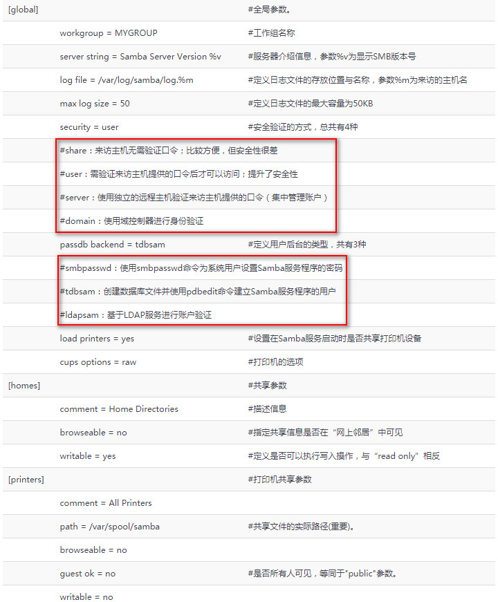
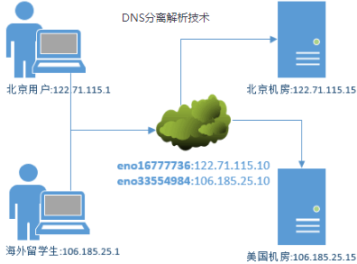

## 目录	

* [FTP 服务](#vsftp)
* [Samba 服务](#Samba)
* [NFS 服务](#NFS)
* [auto 挂载服务](#autofs)
* [Bind 域名解析服务](#Bind)
* [DHCP 服务](#DHCP)
* [邮件系统](#Email)

+ rpm -qa | grep vsftp  　**查询安装的软件**  
+ rpm -e fielname.rpm  

### 1. 使用vsftpd服务传输文件  
    FTP(File Transfer Protocol),基于C/S模式,默认端口:-21-(数据端口),22(命令端口) 
#### 1.1 主动 被动 2种模式
    vsftpd(very secure ftp daemon) 非常安全的FTP守护进程,  匿名开放 本地用户 
#### 1.2 虚拟用户 3种模式 
   
### 2. 服务端  
`[root@xy ~]# yum install vsftpd`  
`[root@xy ~]# iptables -F`  
`[root@xy ~]# service iptables save`   
iptables: Saving firewall rules to /etc/sysconfig/iptables:[  OK  ]  
`[root@xy ~]# mv /etc/vsftpd/vsftpd.conf /etc/vsftpd/vsftpd.conf_bak`  
`[root@xy ~]# grep -v "#" /etc/vsftpd/vsftpd.conf_bak > /etc/vsftpd/vsftpd.conf`  
`[root@xy ~]# cat /etc/vsftpd/vsftpd.conf`

    anonymous_enable=YES  
    local_enable=YES  
    write_enable=YES  
    local_umask=022  
    dirmessage_enable=YES  
    xferlog_enable=YES  
    connect_from_port_20=YES  
    xferlog_std_format=YES  
    listen=NO  
    listen_ipv6=YES  
    pam_service_name=vsftpd  
    userlist_enable=YES  
    tcp_wrappers=YES  
#### 2.1 常用参数:  
    listen=[YES|NO]                       是否以独立运行方式监听  
    listen_address=IP                     设置要监听的IP           
    listen_port=21                        设置FTP服务的监听端口  
    download _enable=[YES|NO]             是否允许下载  
    userlist_enable=[YES|NO]              设置用户列表为允许/禁止操作  
    userlist_deny=[YES|NO]       
    max_client=0                          最大客户连接数 0不限制  
    max_per_ip=0                          同一IP最大连接数  
    anonymous_enable=[YES|NO]             是否允许匿名用户访问  
    anon_upload_enable=[YES|NO]           是否允许匿名用户上传文件  
    anon_umask=022                        匿名用户上传文件的umask值  
    anon_root=/var/ftp                    匿名用户FTP根目录  ✔
    anon_mkdir_write_enable=[YES|NO]      是否允许匿名用户创建目录 
    anon_other_write_enable=[YES|NO]      是否允许匿名用户其他写入权限 重命名 删除等  
    anon_max_rate=0                       匿名用户最大传输速率  
    local_enable=[YES|NO]                 是否允许本地用户登陆FTP  
    local_umask=022                       本地用户上传文件的umask值  
    local_root=/var/ftp                   本地用户FTP根目录  ✔
    chroot_local_user=[YES|NO]            是否将用户权限禁锢在FTP目录,以确保安全  
    local_max_rate=0                      本地用户最大传输速率  

#### 2.2 匿名用户模式开发权限参数
    anonymous_enable=YES                 
    anon_upload_enable=YES               
    anon_umask=022                                                  
    anon_mkdir_write_enable=YES            
    anon_other_write_enable=YES 
 
#### 2.3 客户端:
`[root@xy ~]# yum install ftp`　　　　ftp是Linux以命令行的方式管理FTP传输服务的客户端工具  
`[root@xy ~]# ftp 192.168.37.10` 
 
    Connected to 192.168.37.10 (192.168.37.10).  
    220 (vsFTPd 3.0.2)  
    Name (192.168.37.10:root): anonymous  
    331 Please specify the password.  
	Password:  
	230 Login successful.  
	Remote system type is UNIX.  
	Using binary mode to transfer files.  
	ftp> cd pub  
	250 Directory successfully changed.  
	ftp> mkdir files  
	550 Permission denied   **提示没有权限,查看默认访问目录/var/ftp权限**  
	ftp> exit  
	221 Goodbye.  

`[root@xy ~]# ls -ld /var/ftp/pub`　**ls -Zd**  
drwxr-xr-x. 2 root root 6 Mar  7  2014 /var/ftp/pub  
`[root@xy ~]# chown -Rf ftp /var/ftp/pub`　**更改目录所属主身份为ftp ✔**  
`[root@xy ~]# ls -ld /var/ftp/pub`  
drwxr-xr-x. 2 ftp root 6 Mar  7  2014 /var/ftp/pub  
`[root@xy ~]# ftp 192.168.37.10` 
 
	Connected to 192.168.37.10 (192.168.37.10).  
	220 (vsFTPd 3.0.2)  
	Name (192.168.37.10:root): anonymous  
	331 Please specify the password.  
	Password:  
	230 Login successful.  
	Remote system type is UNIX.  
	Using binary mode to transfer files.  
	ftp> cd pub  
	250 Directory successfully changed.  
	ftp> mkdir files  
	550 Create directory operation failed. 提示创建目录失败,原因所在SElinux
  
`[root@xy ~]# getsebool -a | grep ftp`　 **getsebool -a** 
 
    ftp_home_dir --> off  
    ftpd_anon_write --> off  
    ftpd_connect_all_unreserved --> off  
    ftpd_connect_db --> off  
    ftpd_full_access --> off       **ftp 全部权限未开启 off 改为 on**
  
`[root@xy ~]# setsebool -P ftpd_full_access=on`　 **-P permanent**  
`[root@xy ~]# ftp 192.168.37.10` 
 
	Connected to 192.168.37.10 (192.168.37.10).  
	220 (vsFTPd 3.0.2)  
	Name (192.168.37.10:root): anonymous   默认名称:anonymous  
	331 Please specify the password.  
	Password:  
	230 Login successful.  
	Remote system type is UNIX. 
	Using binary mode to transfer files.  
	ftp> cd pub  
	250 Directory successfully changed.  
	ftp> mkdir files  
	257 "/pub/files" created  
	ftp> rename files database  
	350 Ready for RNTO.  
	250 Rename successful.  
	ftp> rmdir database  
	250 Remove directory operation successful.  
	ftp> exit  
	221 Goodbye.  

#### 2.4 本地用户模式参数:cat /etc/vsftpd/vsftpd.conf  
    anonymous_enable=NO  
    local_enable=YES  
    write_enable=YES  
    local_umask=022  
    userlist_enable=YES  
    userlist_deny=YES  

`[root@xy ~]# ftp 192.168.37.10` 
 
	Connected to 192.168.37.10 (192.168.37.10).  
	220 (vsFTPd 3.0.2)  
	Name (192.168.37.10:root): root  
	530 Permission denied.  
	Login failed.  
	ftp> exit  
	221 Goodbye.  
`[root@xy ~]# cat /etc/vsftpd/user_list`  
`[root@xy ~]# cat /etc/vsftpd/ftpusers` 　**名单中含有root,默认禁止root用户**  
`[root@xy ~]# ftp 192.168.37.10`
>Connected to 192.168.37.10 (192.168.37.10).  
220 (vsFTPd 3.0.2)    
Name (192.168.37.10:root): xy       //  用不在 ftplist / user_list 的用户登录  
331 Please specify the password.  
Password:此处输入该用户密码  
230 Login successfull.  
Reomte system type is UNIX.  
Using binary mode to transfer files.  
ftp> mkdir files  
550 Create directory operation failed.      // 依然无法访问
  
`[root@xy ~]# getsebool -a | grep ftp`     
ftpd_full_access --> off      
`[root@xy ~]# setsebool -P ftpd_full_access=on`  // 可以正常创建文件      
#### 2.5 虚拟用户模式  
`[root@xy ~]# cd /etc/vsftpd/`  
`[root@xy vsftpd]# vim vuser.list`   
   
	zhangsan     账户名
	123456 		密码
	lisi  
	123456   
	redhat  
	123456  
`[root@xy vsftpd]# db_load -T -t hash -f vuser.list vuser.db`  　**db_load**  
`[root@xy vsftpd]# file vuser.db`  
vuser.db: Berkeley DB (Hash, version 9, native byte-order)  
`[root@xy vsftpd]# chmod 600 vuser.db`  
`[root@xy vsftpd]# rm -f vuser.list`  
+++++++++++++++++++++++++++++++++++++++++++++++++++++++++++++++++
`[root@xy ~]# useradd -d /var/ftproot -s /sbin/nologin virtual`   // 增加虚拟用户，提供家目录

    -d 设置默认家目录 	-s 设置默认Shell解释器  (命令 -参数 执行语句)    
 	
`root@xy vsftpd]# ls -ld /var/ftproot/`  
drwx------. 3 virtual virtual 74 Jul 12 08:55 /var/ftproot/  
`[root@xy vsftpd]# chmod -Rf 755 /var/ftproot/`  
`[root@xy vsftpd]# ls -ld /var/ftproot/`  
drwxr-xr-x. 3 virtual virtual 74 Jul 12 08:55 /var/ftproot/  
+++++++++++++++++++++++++++++++++++++++++++++++++++++++++++++++++
> 建立用于支持虚拟用户的PAM文件, vsftpd.vu PAM(可插拔认证模块)是一种验证机制,通过动态链接库和统一的API把系统提供的服务和认证方式分开,采用鉴别模块层、用接口层、应设计层三层设计方式   

`[root@xy ~]# cp -a /etc/pam.d/vsftpd /etc/pam.d/vdftpd.pam`     
`[root@xy ~]# vim /etc/pam.d/vsftpd.vu`    　　**新建虚拟用户认证 PAM 文件 vsftp.vu**
auth      required      pam_userdb.so db=/etc/vsftpd/vuser    
account   required      pam_userdb.so db=/etc/vsftpd/vuser    
+++++++++++++++++++++++++++++++++++++++++++++++++++++++++++++++++
##### 2.5.1主配置文件 vsftpd.conf:   
`[root@xy ~]# mkdir /etc/vsftpd/vusers_dir/`   
`[root@xy ~]# vim /etc/vsftpd/vsftpd.conf`  

    1  anonymous_enable=NO  
    2  local_enable=YES  
    3  guest_enable=YES  
    4  guest_username=virtual  
    5  allow_writeable_chroot=YES
    14 pam_service_name=vsftpd.vu   
    17 user_config_dir=/etc/vsftpd/vusers_dir
+++++++++++++++++++++++++++++++++++++++++++++++++++++++++++++++++  
为了使不同用户有不同权限:  
`[root@xy ~]# cd /etc/vsftpd/vusers_dir`  
`[root@xy vusers_dir]# touch lisi`  
`[root@xy vusers_dir]# vim zhangsan`  

    anon_upload_enable=YES  
    anon_mkdir_write_enable=YES  
    anon_other_write_enable=YES  
`[root@xy ~]# getsebool -a | grep ftp`     
ftpd_full_access --> off      
`[root@xy ~]# setsebool -P ftpd_full_access=on`  // 可以正常创建文件      
`[root@xy vusers_dir]# systemctl restart vsftpd.service`   
`[root@xy vusers_dir]# systemctl enable vsftpd`  

### 3. 简单文件传输协议(TFTP:Trivial File Transfer Protocol)：
#### TFTP 基于UDP(69)协议在（客户端与服务器）之间进行简单文件传输的协议
    ?               帮助  ✔
    put             上传文件   ✔
    get             下载文件  ✔
    verbose         显示详细处理信息   
    status          显示当前状态信息  
    binary          使用二进制进行传输  
    ascii           使用ASCII码传输  
    timeout         设置重传超时时间  
    quit            退出  
`[root@xy ~]# yum install tftp-server tftp`   
`[root@xy ~]# vim /etc/xinetd.d/tftp` 　**修改 disable = no**  
`[root@xy ~]# systemctl restart xinetd` 
`[root@xy ~]# netstat -a | grep tftp`　 	**查询端口启用状态**  
`[root@xy ~]# systemctl enable xinetd`  
`[root@xy ~]# firewall-cmd --permanent --add-port=69/udp`   
success  
`[root@xy ~]# firewall-cmd --reload`   
success  
`[root@xy ~]# echo "I love AnXiaohong" > /var/lib/tftpboot/readme.txt`  
`[root@xy ~]# tftp 192.168.37.10`  
tftp> get readme.txt  
tftp> quit  
`[root@xy ~]# ls`  
anaconda-ks.cfg  Downloads             Pictures    ShellExample  
Desktop          initial-setup-ks.cfg  Public      Templates  
Documents        Music                 readme.txt  Videos  
`[root@xy ~]# cat readme.txt`   
I love AnXiaohong  

### 4. 使用Samba或NFS实现文件"共享"  
   基于**SMB**(Server Messages Block)协议,开发出SMBServer服务程序,**实现Linux与Window**s之间的文件共享变得简单  
  

`[root@xy ~]# yum install samba`   
`[root@xy ~]# mv /etc/samba/smb.conf /etc/samba/smb.conf.bak`  
`[root@xy ~]# cat /etc/samba/smb.conf.bak | grep -v "#" | grep -v ";" | grep -v "^$" > /etc/samba/smb.conf` 　 **-v 反选(排除)， ^$ 空白行**  
  

`[root@xy ~]# cat /etc/samba/smb.conf`  

    [global]		#全局参数  
        workgroup = MYGROUP	#工作组名称  
        server string = Samba Server Version %v	   
			#服务器介绍信息，参数%v为显示SMB版本号  
        log file = /var/log/samba/log.%m  	      
			#定义日志文件的存放位置与名称，参数%m为来访的主机名  
        max log size = 50	
                    #定义日志文件的最大容量为50KB
        security = user		#安全验证的方式，总共有4种
			#share：来访主机无需验证口令；比较方便，但安全性很差
			#user：需验证来访主机提供的口令后才可以访问；提升了安全性
			#server：使用独立的远程主机验证来访主机提供的口令（集中管理账户）
			#domain：使用域控制器进行身份验证
        passdb backend = tdbsam		#定义用户后台的类型，共有3种
			#smbpasswd：使用smbpasswd命令为系统用户设置Samba服务程序的密码
			#tdbsam：创建数据库文件并使用pdbedit命令建立Samba服务程序的用户
			#ldapsam：基于LDAP服务进行账户验证
        load printers = yes		
                    #设置在Samba服务启动时是否共享打印机设备
        cups options = raw		
                    #打印机的选项
    [homes]		#共享参数
        comment = Home Directories		#描述信息
        browseable = no		#指定共享信息是否在“网上邻居”中可见
        writable = yes		#定义是否可以执行写入操作，与“read only”相反
    [printers]			#打印机共享参数
        comment = All Printers	
        path = /var/spool/samba	#共享文件的实际路径(重要)。
        browseable = no	
        guest ok = no		#是否所有人可见，等同于"public"参数。
        writable = no	
        printable = yes  
    [database]               #共享名称database  ✔
        comment = Do not arbitrarily modify the database file
        path = /home/database   ✔
        public = no
        writable = yes
#### 4.3 pdbedit 命令管理SMB服务程序的账户信息数据库，配置Samba服务器:  
    -a 建立Samba账户　-x 删除Samba账户　-L 列出Samba账户　-Lv 列出账户详尽信息  
`[root@xy ~]# id xy`  
uid=1000(xy) gid=1000(xy) groups=1000(xy)    
`[root@xy ~]# pdbedit -a xy`  ✔       
new password:  
retype new password:  
Unix username:        xy  
NT username:            
Account Flags:          
User SID:             S-1-5-21-2962875295-3166855154-885293666-1000  
Primary Group SID:    S-1-5-21-2962875295-3166855154-885293666-513  
Full Name:            xy  
Home Directory:       \\xy\xy  
HomeDir Drive:        
Logon Script:         
Profile Path:         \\xy\xy\profile  
Domain:               XY  
Account desc:          
Workstations:           
Munged dial:            
Logon time:           0  
Logoff time:          Wed, 06 Feb 2036 23:06:39 CST  
Kickoff time:         Wed, 06 Feb 2036 23:06:39 CST  
Password last set:    Thu, 12 Jul 2018 11:09:43 CST  
Password can change:  Thu, 12 Jul 2018 11:09:43 CST  
Password must change: never  
Last bad password   : 0 
Bad password count  : 0  
Logon hours         : FFFFFFFFFFFFFFFFFFFFFFFFFFFFFFFFFFFFFFFFFF  

`[root@xy ~]# mkdir /home/database`  
`[root@xy ~]# chown -Rf xy:xy /home/database/`  
`[root@xy ~]# ls -ld /home/database/`  
drwxr-xr-x. 2 xy xy 6 Jul 12 11:10 /home/database/  
`[root@xy ~]# semanage fcontext -a -t samba_share_t /home/database`     
`[root@xy ~]# restorecon -Rv /home/database/`  
restorecon reset /home/database context unconfined_u:object_r:home_root_t:s0->unconfined_u:object_r:samba_share_t:s0  
`[root@xy ~]# getsebool -a | grep samba`  
   samba_create_home_dirs --> off  
   samba_domain_controller --> off  
   samba_enable_home_dirs --> off                  
`[root@xy ~]# setsebool -P samba_enable_home_dirs on`    在smb.conf，中设置path = /home/database  
`[root@xy ~]# systemctl restart smb`  
`[root@xy ~]# systemctl enable smb`  
ln -s '/usr/lib/systemd/system/smb.service' '/etc/systemd/system/multi-user.target.wants/smb.service'  
`[root@xy ~]# iptables -F`  
`[root@xy ~]# service iptables save`  
iptables: Saving firewall rules to /etc/sysconfig/iptables:[  OK  ]  

#### 4.4 Linux 访问文件共享服务(Samba客户端)  
+ 客户端安装 cifs-utils,配置认证文件  
`[root@xy ~]# yum install cifs-utils`   
`[root@xy ~]# vim auth.smb`  

        username=xy  
        password=redhat  
        domain=MYGROUP  
`[root@xy ~]# chmod 600 auth.smb`  
在Linux客户端创建用于挂载Samba服务共享资源目录,写入/etc/fstab
`[root@xy ~]# mkdir /database`  
`[root@xy ~]# vim /etc/fstab`   
//Samba服务器IP/共享目录 /客户端目录 cifs credentials=/root/auth.smb 0 0   
`[root@xy ~]# smbclient -U 用户名 -L //服务器IP`    #查看服务器共享  
`[root@xy ~]# smbclient -U 用户名 //服务器IP/共享名`    #登录服务器共享  
#### 4.4 Window 登录方式  
 `\\服务器IP\共享名       net use * /del`  

### 5. NFS基于TCP/IP协议，用于Linux系统之间上文件资源共享 C/S
#### 5.1 服务端 192.168.37.10  
`[root@xy ~]# yum install -y nfs-utils`  
`[root@xy ~]# iptables -F`  
`[root@xy ~]# service iptables save`  
`[root@xy ~]# mkdir /nfsfile`   
`[root@xy ~]# chmod -Rf 777 /nfsfile`   
iptables: Saving firewall rules to /etc/sysconfig/iptables:[  OK  ]   
`[root@xy ~]# vim /etc/exports`   **nfs 配置文件**    
/nfsfile 192.168.37.10/24.*(rw,sync,root_squash) 

    参数:  
    ro 	只读  rw 只写  *不共存* 
    root_squash 			NFS客户端以root管理员访问,映射为NFS服务器的匿名用户  
    no_root_squash 			NFS客户端以root管理员访问,映射为NFS服务器的root管理员  
    all_squash 				无论NFS客户端以什么访问,均映射为NFS服务器的匿名用户  
    sync 					同时将数据写入内存与硬盘中,保证不丢失数据  
    async 					先将数据保存至内存,然后再写入硬盘,效率高,可能丢失数据  
`[root@xy ~]# systemctl restart rpcbind`   
`[root@xy ~]# systemctl enable rpcbind`  
`[root@xy ~]# systemctl start nfs-server`  
`[root@xy ~]# systemctl enable nfs-server`  
ln -s '/usr/lib/systemd/system/nfs-server.service' '/etc/systemd/system/  
nfs.target.wants/nfs-server.service'  

#### 5.1 客户端配置   
    -e 显示NFS服务器的共享列表 -a 显示本机挂载文件资源的情况 -v 显示版本
`[root@xy~]# showmount -e 192.168.37.10`  
Export list for 192.168.37.10:  
/nfsfile 192.168.37.10  
`[root@xy ~]# mkdir /nfsfile`		**客户端创建挂载地址**  
`[root@xy ~]# mount -t nfs 192.168.37.10:/nfsfile /nfsfile` 
`[root@xy ~]# cat /nfsfile/readme`   
192.168.10.10:/nfsfile /nfsfile nfs defaults 0 0  

### 6. auto自动挂载服务  
`[root@xy ~]# yum install autofs`  
`[root@xy ~]# vim /etc/auto.master`　　**autofs 的配置文件**  
`/media /etc/iso.misc`　　**挂载目录 子配置文件; 挂在目录是设备挂载位置的上一级目录**  
`[root@xy ~]# vim /etc/iso.misc`		**子配置文件**  
`iso      -fstype=iso9660,ro,nosuid,nodev :/dev/cdrom`   
**挂载目录  挂载文件类型及权限                :设备名称**

### 7. 使用BIND提供域名解析服务(Berkeley Internet Name Domain)  
+ DNS(Domain Name System)：管理和解析(*域名 与 IP*)的对应关系，域名-->IP(正向解析)，IP-->域名(反向解析)  
+ DNS服务器:主服-masster、从服-slave、缓存服三种,DNS域名解析服务采用分布式数据结构,执行查询请求有 
+ 递归查询(必须向用户返回结果) 迭代查询(一台接一台,直到返回结果)  
   - 配置Bind(Berkely Internet Name Domain)服务:  
   - 主配置文件`/etc/named.conf`----定义bind服务程序的运行  
   - 区域配置文件`/etc/named.rfc1912.zones`----保存域与IP所在的具体位置  
   - 数据配置文件目录`/var/named`----保存域名与IP真实对应关系数据  
    
   
 
`[root@xy ~]# yum install bind-chroot`  
`[root@xy ~]# vim /etc/named.conf`	        **主配置文件**
     
     1 //
     2 // named.conf
     3 //
     4 // Provided by Red Hat bind package to configure the ISC BIND named(8) DNS
     5 // server as a caching only nameserver (as a localhost DNS resolver only).
     6 //
     7 // See /usr/share/doc/bind*/sample/ for example named configuration files.
     8 //
     9 
     10 options {
     11 listen-on port 53 { any; };     // ****重要*****
     12 listen-on-v6 port 53 { ::1; };
     13 directory "/var/named";
     14 dump-file "/var/named/data/cache_dump.db";
     15 statistics-file "/var/named/data/named_stats.txt";
     16 memstatistics-file "/var/named/data/named_mem_stats.txt";
     17 allow-query { any; };       // ****重要*****
     18 
     19 /* 
     20 - If you are building an AUTHORITATIVE DNS server, do NOT enable re cursion.
     1,1 Top
     21 - If you are building a RECURSIVE (caching) DNS server, you need to enable 
     22 recursion. 
     23 - If your recursive DNS server has a public IP address, you MUST en able access 
     24 control to limit queries to your legitimate users. Failing to do so will
     25 cause your server to become part of large scale DNS amplification 
     26 attacks. Implementing BCP38 within your network would greatly
     27 reduce such attack surface 
     28 */
     29 recursion yes;
     30 
     31 dnssec-enable yes;
     32 dnssec-validation yes;
     33 dnssec-lookaside auto;
     34 
     35 /* Path to ISC DLV key */
     36 bindkeys-file "/etc/named.iscdlv.key";
     37 
     38 managed-keys-directory "/var/named/dynamic";
     39 
     40 pid-file "/run/named/named.pid";
     41 session-keyfile "/run/named/session.key";
     42 };
     43 
     44 logging {
     45 channel default_debug {
     46 file "data/named.run";
     47 severity dynamic;
     48 };
     49 };
     50 
     51 zone "." IN {
     52 type hint;
     53 file "named.ca";
     54 };
     55 
     56 include "/etc/named.rfc1912.zones";
     57 include "/etc/named.root.key";
++++++++++++++++++++++++++++++++++++++++++++++++++++++++++++++++++++++
#### 7.1 正向解析 eg: 
`[root@xy ~]# vim /etc/named.rfc1912.zones`   **正向解析 区域配置文件**

    zone "xy.com" IN {  		  
       type master;  
       file "xy.com";  
       allow-update { none; };  
    };  

`[root@xy named]# ls -al named.localhost`     **正向解析 数据配置文件**  
-rw-r-----. 1 root named 152 Jun 21  2007 named.localhost  
`[root@xy named]# cp -a named.localhost xy.com.zone`  
`[root@xy named]# vim xy.com.zone`  

    $TTL 1D	#生存周期为1天				
    @	IN SOA	xy.com.	root.xy.com.	(	
    #授权信息开始:	#DNS区域的地址	#域名管理员的邮箱(不要用@符号)	
                        0;serial	#更新序列号
                        1D;refresh	#更新时间
                        1H;retry	#重试延时
                        1W;expire	#失效时间
                        3H;)minimum	#无效解析记录的缓存时间
    NS	ns.xy.com.	#域名服务器记录
    ns	IN A	192.168.37.10	#地址记录(ns.xy.com.)
    IN MX 10	mail.linuxprobe.com.	#邮箱交换记录
    mail	IN A	192.168.37.10	#地址记录(mail.xy.com.)
    www	IN A	192.168.37.10	#地址记录(www.xy.com.)
    bbs	IN A	192.168.37.20	#地址记录(bbs.xy.com.)
`[root@xy ~]# systemd restart named` 
`[root@xy ~]# systemctl restart network`  **虚拟机环境下一定要先把本机DNS配置为本机IP**  
`[root@xy ~]# nslookup`     **测试**  
> www.xy.com  
Server:		192.168.37.10  
Address:	192.168.37.10#53  

Name:	www.xy.com  
Address: 192.168.37.10  
> bbs.xy.com  
Server:		192.168.37.10  
Address:	192.168.37.10#53  

Name:	bbs.xy.com  
Address: 192.168.37.20   
+++++++++++++++++++++++++++++++++++++++++++++++++++++++++++++++++++++++         
#### 7.2 反向解析 eg:  
`[root@xy ~]# vim /etc/named.rfc1912.zones`   **反向解析 区域配置文件**

    zone "xy.com" IN {  
       type master;  
       file "xy.com.zone";  
       allow-update { none; };  
    };  
    zone "37.168.192.in-addr.arpa" IN {     // 写出 IP 地址的网络位 即可
        type master;
        file "192.168.37.arpa";
    };

`[root@xy named]# cp -a named.loopback 192.168.37.arpa`    **反向解析 数据配置文件**   
`[root@xy named]# vim 192.168.37.arpa`  
  
    $TTL 1D				
    @	IN SOA	xy.com.	root.xy.com.	(
                        0;serial
                        1D;refresh
                        1H;retry
                        1W;expire
                        3H);minimum
    NS	ns.xy.com.	
    ns	A	192.168.37.10	
    10	PTR	ns.xy.com.	#PTR为指针记录，仅用于反向解析中。
    10	PTR	mail.xy.com.	
    10	PTR	www.xy.com.	
    20	PTR	bbs.xy.com.
`[root@xy ~]# systemd restart named`    
`[root@xy named]# nslookup`   
> 192.168.37.10  
Server:		192.168.37.10  
Address:	192.168.37.10#53  

10.37.168.192.in-addr.arpa	name = www.xy.com.  
10.37.168.192.in-addr.arpa	name = mail.xy.com.  
10.37.168.192.in-addr.arpa	name = ns.xy.com.  
> 192.168.37.20  
Server:		192.168.37.10  
Address:	192.168.37.10#53  

20.37.168.192.in-addr.arpa	name = bbs.xy.com.  
> exit  
 
### 8. 部署主从服务器  
#### 8.1 无加密的传输  
1. 主服务器的配置IP：192.168.37.10  
`[root@xy ~]# vim /etc/named.rfc1912.zones`   
    
        zone "xy.com" IN {
            type master;
            file "xy.com.zone";
            allow-update { 192.168.37.20; };
        };
        zone "37.168.192.in-addr.arpa" IN {
            type master;
            file "192.168.37.arpa";
            allow-update { 192.168.37.20; };
        };
`[root@xy ~]# systemd restart named` 
2. 从服务器的配置IP：192.168.37.20  
`[root@xy ~]# vim /etc/named.rfc1912.zones`         

         zone "xy.com" IN {
            type slave;
            masters { "192.168.37.10" };
            file "slaves/xy.com.zone";
        };
        zone "37.168.192.in-addr.arpa" IN {
            type slave;
            masters { "192.168.37.10" };
            file "slaves/192.168.37.arpa";
        };
`[root@xy ~]# systemd restart named`    // 重启后，从服务器的DNS服务程序一般就已经自动从主服务器同步了数据  
`[root@xy ~]# cd /var/named/slaves`  
`[root@xy ~]# ls`  
192.168.37.arpa xy.com.zone  
`[root@xy ~]# nslookup`  
    > www.xy.com  
    Server: 192.168.37.20
    Address: 192.168.37.20#53  
    Name: www.xy.com
    Address: 192.168.37.10  
    > 192.168.37.10  
    Server: 192.168.37.20  
    Address: 192.168.37.20#53  
    10.37.168.192.in-addr.arpa name = www.xy.com.
    10.37.168.192.in-addr.arpa name = ns.xy.com.  
    10.37.168.192.in-addr.arpa name = mail.xy.com.  
#### 8.2 有加密的安全传输
1. 主服务器下生成密钥  
`[root@xy ~]# dnssec-keygen -a HMAC-MD5 -b 128 -n HOST master-slave`   //   -a 指定算法    
Kmaster-slave.+157+39112  
`[root@xy ~]# ls -al Kmaster-slave.+157+39112.`  
-rw-------. 1 root root  56 Jul 13 13:10 Kmaster-slave.+157+39112.key  
-rw-------. 1 root root 165 Jul 13 13:10 Kmaster-slave.+157+39112.private  
`[root@xy ~]# cat Kmaster-slave.+157+39112.private`   
Private-key-format: v1.3  
Algorithm: 157 (HMAC_MD5)  
Key: pOuRN4eeVTzrZs/aaVpbkQ==      **key**  
Bits: AAA=  
Created: 20180713051051  
Publish: 20180713051051  
Activate: 20180713051051  

`[root@xy ~]# cd /var/named/chroot/etc/`    **主服务器创建密钥验证文件**  
`[root@xy etc]# vim transfer.key`
  
	key "master-slave" {  
        algorithm hmac-md5;  
        secret "pOuRN4eeVTzrZs/aaVpbkQ==";  
	};   
`[root@xy etc]# chown root:named transfer.key`  
`[root@xy etc]# chmod 640 transfer.key`   
`[root@xy etc]# ln transfer.key /etc/transfer.key `  

`[root@xy etc]# vim /etc/named.conf`		**开启加载Bind服务的密钥验证功能**
  
	include "/etc/transfer.key"   //9 行  
	allow-transfer { key master-slave; };  
`[root@xy ~]# systemd restart named`      
`[root@xy ~]# rm -rf /var/named/slaves`     **清空从服务器数据配置文件**  
`[root@xy ~]# systemd restart named`    
2. 配置从服务器  
`[root@xy ~]# cd /var/named/chroot/etc/`  
`[root@xy etc]# vim transfer.key`
  
	key "master-slave" {  
        algorithm hmac-md5;  
        secret "pOuRN4eeVTzrZs/aaVpbkQ==";  
	};   
`[root@xy etc]# chown root:named transfer.key`  
`[root@xy etc]# chmod 640 transfer.key`  
`[root@xy etc]# ln transfer.key /etc/transfer.key`   

`[root@xy etc]# vim /etc/named.conf`      **开启加载从服务器的密钥验证功能，填写主服务器IP和密钥名称**
  
	include "/etc/transfer.key"   //9 行  
	server 192.168.37.10      //43行  
	{  
		key { master-slave; };   //45行  
`[root@xy ~]# systemd restart named`      
`[root@xy ~]# ls /var/named/slaves`
`[root@xy ~]# systemd restart named`      
`192.168.37.arpa xy.com.zone`  

#### 8.3 部署缓存服务器  
缓存服务器就是把用户经常用的域名与IP地址的解析记录保存到主机本地，从而提升下次解析效率；

1. 缓存服务器   
    + 外网卡：通过DHCP或手动指定IP与网关信息(桥接网卡)   
    + 内网卡： 192.168.37.10(主机模式)  
    + 客户端： 192.168.37.20  
2. 添加缓存转发参数：  
`[root@xy.com ~]# vim /etc/named.conf`  
`forwoarders {210.73.64.1}` // 17行 添加上级DNS服务器地址  
`[root@xy.com ~]# system restart named`  
更改客户端主机DNS为 192.168.37.10  

#### 8.4 分离解析技术  
使用多台服务器并分别部署在全球各地，然后再使用DNS服务的分离解析功能，即可让位于不同地理范围内的用户通过访问相同的网址，而从不同的服务器获取到相同的数据。  
  

+ DNS 服务器：  
    +   122.71.115.10   (china)    
    +   106.185.25.10   (US)  
+ 客户端：
    +   122.71.115.1    (国内读者)  
    +   106.185.25.1    (国外读者)  
   
####8.4.1 编辑主配置文件：  
`[root@xy.com ~]# vim /etc/named.conf`  
删除 51-54 行的根域信息

    zone "." IN {
        type hint;
        file "named.ca";
    };
####8.4.2 编辑区域配置文件：
`[root@xy ~]# vim /etc/named.rfc1912.zones`  

    1 acl "china" { 122.71.115.0/24; };
    2 acl "american" { 106.185.25.0/24;};
    3 view "china"{
    4 match-clients { "china"; };
    5 zone "linuxprobe.com" {
    6 type master;
    7 file "xy.com.china";
    8 };
    9 };
    10 view "american" {
    11 match-clients { "american"; };
    12 zone "xy.com" {
    13 type master;
    14 file "xy.com.american";
    15 };
    16 };
####8.4.3 建立数据配置文件：
`[root@xy ~]# cd /var/named`  
`[root@xy named]# cp -a named.localhost`      
xy.com.china  
`[root@xy named]# cp -a named.localhost `    
xy.american  
`[root@xy named]# vim xy.com.china`  

    $TTL 1D	#生存周期为1天				
    @	IN SOA	xy.com.	root.xy.com.	(	
    #授权信息开始:	#DNS区域的地址	#域名管理员的邮箱(不要用@符号)	
                                    0;serial	        #更新序列号
                                    1D;refresh	 #更新时间
                                    1H;retry	       #重试延时
                                    1W;expire	          #失效时间
                                    3H;)minimum     #无效解析记录的缓存时间
    NS	ns.xy.com.	#域名服务器记录
    ns	IN A	122.71.115.10	#地址记录(ns.xy.com.)
    www	IN A	122.71.115.15	#地址记录(www.xy.com.)
`[root@linuxprobe named]# vim linuxprobe.com.american`  

    $TTL 1D	#生存周期为1天				
    @	IN SOA	xy.com.	root.xy.com.	(	
                                    #授权信息开始:	#DNS区域的地址	#域名管理员的邮箱(不要用@符号)	
                                    0;serial	#更新序列号
                                    1D;refresh	#更新时间
                                    1H;retry	#重试延时
                                    1W;expire	#失效时间
                                    3H;)minimum	#无效解析记录的缓存时间
    NS	ns.xy.com.	#域名服务器记录
    ns	IN A	106.185.25.10	#地址记录(ns.xy.com.)
    www	IN A	106.185.25.15	#地址记录(www.xy.com.)

### 9. 使用DHCP动态管理主机地址  
+ DHCP(Dynamic Host Configuration Protocol):基于UDP协议仅仅在局域网内部使用提高IP利用率,提高配置效率,降低管理维护成本  
+ 作用域:完整的IP段,DHCP协议根据作用域分配IP  
+ 超级作用域:	管理处于一个物理网络中多个逻辑子网段  
+ 排除范围: 把作用域的某些IP排除  
+ 地址池: 剩余的IP  
+ 租约: DHCP 客户端能够使用IP的时间  
+ 预约: 保证网络中特定设备总是获取到相同IP  
`[root@xy ~]# yum install dhcp`   
`[root@xy ~]# /etc/dhcp/dhcpd.conf`      
#### 9.1 dhcpd.conf 配置:  
#### 9.2 dhcpd服务程序配置最常见参数:  
    ddns-update-style [类型]           	DNS 服务更新类型 none interim ad-hoc  
    [allow | ignore] client-update 
    default-lease-time [21600]            默认超时时间  
    max-lease-time [43200]                 
    option domain-name-server [8.8.8.8]  
    option domain-name ["domain.org"]  
    range                                  定义分配的IP地址池  
    option subnet-mask                  定义客户端子网掩码 
    option routers                         定义客户端网关地址  
    broadcast-address [广播地址]          
    ntp-server [IP]                    定义客户端网络时间服务器(NTP)  
    nis-servers [IP]                   定义客户端NIS域服务器地址                  
    Hardware [网卡物理地址]             
    server-name [主机名]			向DHCP客户端通知DHCP服务器的主机名  
    fixed-address [IP]          将某个固定IP地址分配给指定主机
    time-offset [偏移误差]      
       
	ddns-update-style none;  
	ignore client-updates;  
	subnet 192.168.10.1 netmask 255.255.255.0 {  
          range 192.168.10.50 192.168.10.150;  
          option subnet-mask 255.255.255.0;  
          option domain-name-servers 192.168.10.1;       定义默认搜索域
          option domain-name "xy.com";  
          option routers 192.168.10.1;         定义客户端网关 
          default-lease-time 21600;  
          max-lease-time 43200;  
    }  
`[root@xy ~]# systemctl start dhcpd`   
`[root@xy ~]# systemctl enable dhcpd`  

#### 9.3分配固定IP：IP与MAC地址绑定  
	host xy {  
		hardware ethernet 00:0c:29:11:26:05;  
		fixed-address 192.168.37.55;  
	}

### 10. 使用Postfix 与 Dovecot部署邮件系统  
+ 电子邮件协议:
   - 简单邮件传输协议（Simple Mail Transfer Protocol，**SMTP**）：用于**发送和中转发出的电子邮件**，占用服务器的**25/TCP端口**。
   - 邮局协议版本3（**Post Office Protocol 3**）：用于将**电子邮件存储到本地主机**，占用服务器的**110/TCP**端口。
   - Internet消息访问协议版本4（**Internet Message Access Protocol 4**）：用于在**本地主机上访问邮件**，占用服务器的**143/TCP**端口。
   - MUA----SMTP---->MTA----SMTP---->MTA----POP3/IMAP4---->MUA  

#### 10.1 配置DNS服务程序bind-chroot  
`[root@xy ~]# iptables -F`  
`[root@xy ~]# service iptables save`  
iptables: Saving firewall rules to /etc/sysconfig/iptables:[  OK  ]  
`[root@xy ~]# systemctl disable iptables`  
`[root@xy ~]# systemctl disable firewalld.service`   
`[root@xy ~]# vim /etc/hostname`  
mail.xy.com  
`[root@xy ~]# hostname` 		**服务器主机名与发信域名保持一致** 
mail.xy.com  
`[root@mail named]# vim /etc/named.conf`        **主配置文件**
   
    listen-on port 53 { any; };          
    allow-query     { any; };  
`[root@mail named]# vim /etc/named.rfc1912.zones`      **区域配置文件**
 
	zone "xy.com" IN {  
         type master;  
         file "xy.com.zone";  
         allow-update { none; };  
	};  
`[root@mail named]# vim xy.com.zone`         **域名数据配置文件**
   
	$TTL 1D
	@       IN SOA  xy.com. root.xy.com. (  
                                         0       ; serial  
                                         1D      ; refresh  
                                         1H      ; retry  
                                         1W      ; expire  
                                         3H )    ; minimum  
            NS              ns.xy.com.  
       ns      IN A            192.168.37  
	@       IN MX 10        mail.xy.com.  
	mail    IN A            192.168.37.10  

#### 10.2 配置基于SMTP协议的Postfix服务程序  
`[root@xy ~]# yum install postfix`   
`[root@mail ~]# vim /etc/postfix/main.cf`
  
	myhostname = mail.xy.com      			//76  
	mydomain = xy.com            			//83  
	myorigin = $mydomain           				//99  
	inet_interfaces = all            			//116  
	mydestination = $myhostname , $mydomain    //164  定义可接收邮件的主机名或域名列表
	(relay_domains = $mydestination)  

`[root@mail named]# useradd boss`      ** 创建邮件系统登陆用户**
`[root@mail named]# echo "xy" | passwd --stdin boss`  
Changing password for user boss.  
passwd: all authentication tokens updated successfully.  
`[root@mail ~]# systemctl restart postfix`  
`[root@mail ~]# systemctl enable postfix`  

#### 10.3 配置基于POP3与IMAP4协议的Dovecot服务程序  
`[root@xy ~]# yum install dovecot`   
`[root@mail ~]# vim /etc/dovecot/dovecot.conf`

	protocols = imap pop3 lmtp         			// 24  
	disable_plaintext_auth = no        			//25  
	login_trusted_networks = 192.168.37.0/24     //48  

`[root@mail ~]# vim /etc/dovecot/conf.d/10-mail.conf`   
mail_location = mbox:~/mail:INBOX=/var/mail/%u  
`[root@mail ~]# su - boss`  
`[boss@mail ~]$ mkdir -p mail/.imap/INBOX`  
`[boss@mail ~]$ exit`  
logout  
`[root@mail ~]# systemctl restart dovecot`  
`[root@mail ~]# systemctl enable dovecot`  
ln -s '/usr/lib/systemd/system/dovecot.service' '/etc/systemd/system/multi-user.target.wants/dovecot.service'  
[返回目录](#back)
