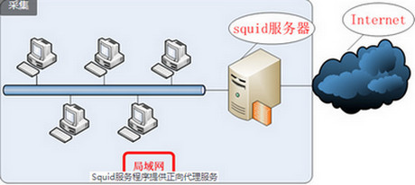
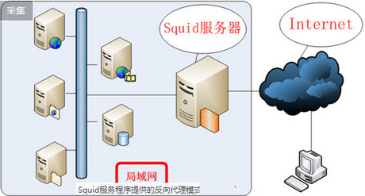

## 目录	

* [Squid 服务](#Squid)  
* [iSCIS 服务](#iSCIS)  
* [MangoDB 服务](#MangoDB)  
* [无人值守安装服务](#无人值守安装)

### 1. 使用Squid部署代理缓存服务  
+ Squid 替代用户向网站服务器请求页面数据并进行缓存,当用户再次再请求相同数据,则可以将
存储服务器本地数据交付给用户,减少了用户等待时间,支持HTTP、FTP、SSL等多种协议  
+ Squid分为正向代理 与 反向代理: 
    - 正向代理:用户(局域网)-->Squid-->网站资源,以及基于ACL功能对用户访问网站进行限制,具体分为标准代理模式 与 透明代理模式,标准模式是把网站数据缓存到本地服
务器上,提高数据资源再次访问时的效率,但用户必须填写代理服务器IP与端口;透明模式则不需要  
  
    - 反向代理:让多节点主机反向缓存网站数据 服务器机房(多节点主机-->Squid服务器-->Internet-->用户)   
    
+ 测试设备:  
   - Linux主机(**内网卡:仅主机模式192.168.37.10，外网卡:桥接模式DHCP**)    
   - Windows主机(**网卡:仅主机模式192.168.37.20**) 
   
`[root@xy ~]# nmtui` 					**GUI下配置网卡参数**  
`[root@xy ~]# nmcli connection show`  
NAME         UUID                                  TYPE            DEVICE        
eno33554968  516ae9a1-831d-4a5e-a76a-fb74933f6436  802-3-ethernet   eno33554968   
eno16777728  5cd38b22-b35b-474b-a7a2-a0ae8f632216  802-3-ethernet  eno16777728  
`[root@xy ~]# nmcli con show eno33554968`    
`[root@xy ~]# vim /etc/squid/squid.conf` 
 
    http_port 3128								监听端口 
    cache_mem 64M							    内存缓冲区  
    cache_dir ufs /var/spool/squid 2000 16 256	硬盘缓冲区  
    cache_effective_user squid 					设置缓存的有效用户**  
    cache_effective_group squid 			设置缓存有效用户组  
    dns_nameservers [IP] 			    一般不设置,用服务器默认的DNS  
    cache_access_log /var/log/squid/access.log  访问日志文件的保存路径  
    cache_log /var/log/squid/cache.log   	  缓存日志文件的保存路径  
    visible_hostname xy.com    			      设置Squid服务器名称  
`[root@xy ~]# systemctl restart squid`  
`[root@xy ~]# systemctl enable squid`  
ln -s '/usr/lib/systemd/system/squid.service' '/etc/systemd/system/multi-user.target.wants/squid.service'  
`[root@xy ~]# semanage port -l | grep squid_port_t`
  
    squid_port_t                   tcp      3128, 3401, 4827  
    squid_port_t                   udp      3401, 4827  
`[root@xy ~]# semanage port -a -t squid_port_t -p tcp 10000`
  
     squid_port_t                   tcp      10000, 3128, 3401, 4827  
     squid_port_t                   udp      3401, 4827  
`[root@xy ~]# getsebool -a | grep squid` 
 
    squid_connect_any --> on  
    squid_use_tproxy --> off  
`[root@xy ~]# vim /etc/squid/squid.conf`    **Squid 提供的ACL功能**

    acl client src = 192.168.37.20   仅允许192.168.37.20使用Squid提供的代理服务  
    acl deny_keyword url_regex -i linux     禁止访问包含linux关键词的网站  
    acl deny_url url_regex http://linuxcool.com  
    acl badfile urlpath_regex -i \.rar$ \.avi$     禁止下载.rar .avi 资源 
    http_access deny deny_url  
    http_access deny deny_keyword  
    http_access deny badfile 
    http_access allow client  
    http_access deny all  

`[root@xy ~]# iptables -F`  
`[root@xy ~]# iptables -t nat -A POSTROUTING -p udp --dport 53 -o eno33554968 -j MASQUERADE` **实现DNS地址解析服务53端口的数据转发功能**   
`[root@xy ~]# echo "net.ipv4.ip_forwrad=1" >> /etc/sysctl.conf`  
`[root@xy ~]# sysctl -p`  
`[root@xy ~]# net.ipv4.ip_forward = 1`  
`[root@xy ~]# vim /etc/squid/squid.conf`  

    http_port 3128 transparent              **透明模式**  
    cache_dir ufs /var/spool/squid 100 16 256  
`[root@xy ~]# squid -k parse` 		**检测主配置文件是否有错**  
`[root@xy ~]# squid -z`                     **对服务程序透明化进行初始化**  
`[root@xy ~]# iptables -t nat -A PREROUTING -p tcp -m tcp --dport 80 -j REDIRECT --to -ports 3128`     
**SNAT 设置对网站80端口请求转发至Squid服务器本地3128端口**  
`[root@xy ~]# iptables -t nat -A PREROUTING -s 192.168.37.0/24 -o eno33554968 -j SNAT --to 桥接网卡IP`  
 

### 2. 使用iSCSI(Internet Small Computer System Interface)  
+ IDE(成熟稳定,价格便宜并行传输接口) 
+ SATA(传输速度更快,数据校验更完整串行传输接口)
+ SCSI(计算机和硬盘、光驱等设备间系统级接口通用标准,系统资源占用率低、转速快、传输速度快)
+ 基于TCP/IP协议和SCSI接口协议的iSCSI是将SCSI接口与以太网技术结合的新型存储技术,可以来在网络中传输SCSI接口命令和数据,
+ 需要网卡传输,iSCSI-HBA网卡,该网卡连接SCSI接口或者FC(光纤通道)总线和内存,用于主机之间交换存储数据
### 2.1 配置iSCSI服务端  
#### 2.1.2 创建RAID 5磁盘阵列:  
`[root@xy ~]# mdadm -Cv /dev/md0 -n 3 -l 5 -x 1 /dev/sdb /dev/sdc /dev/sdd /dev/sde`  
`[root@xy ~]# mdadm -D /dev/md0` 				**查看设备详细信息**  
#### 2.1.3 安装iSCSI服务端(192.168.37.1)： 
`[root@xy ~]# yum -y install targetd targetcli`    
`[root@xy ~]# systemctl restart targetd`  
`[root@xy ~]# systemctl enable targetd`  
ln -s '/usr/lib/systemd/system/targetd.service' '/etc/systemd/system/multi-user.target.wants/targetd.service'  
+++++++++++++++++++++++++++++++++++++++++++++++++  +++++  
`[root@xy ~]# targetcli`       	**交互式配置界面**  
Warning: Could not load preferences file /root/.targetcli/prefs.bin.  
targetcli shell version 2.1.fb34  
Copyright 2011-2013 by Datera, Inc and others.  
For help on commands, type 'help'.  
/> **ls**  
o- / ..................................................................... [...]  
  o- backstores .......................................................... [...]  
  | o- block .............................................. [Storage Objects: 0]  
  | o- fileio ............................................. [Storage Objects: 0]  
  | o- pscsi .............................................. [Storage Objects: 0]  
  | o- ramdisk ............................................ [Storage Objects: 0]  
  o- iscsi ........................................................ [Targets: 0]  
  o- loopback ..................................................... [Targets: 0]  

> **cd /backstores/block**           共享设备位置  
/backstores/block> **create disk0 /dev/md0**  
Create block storage object disk0 using /dev/md0.    
/backstores/block> **cd /**   
/> **ls**  
o- / ..................................................................... [...]  
  o- backstores .......................................................... [...]  
    o-disk0 ........................ [/dev/md0 (40.0GiB write-thru deactivated)]  
  | o- block .............................................. [Storage Objects: 0]  
  | o- fileio ............................................. [Storage Objects: 0]  
  | o- pscsi .............................................. [Storage Objects: 0]  
  | o- ramdisk ............................................ [Storage Objects: 0]  
  o- iscsi ........................................................ [Targets: 0]  
  o- loopback ..................................................... [Targets: 0]  
++++++++++++++++++++++++++++++++++++++++++++++++++++++++++++  
/> **cd iscsi**               创建iSCSI target名称及配置共享资源  
/iscsi> **create**  
Created target iqn.2003-01.org.linux-iscsi.xy.x8664:sn.ca5dd98d2e7d.  
Created TPG 1.  
/iscsi> cd iqn.2003-01.org.linux-iscsi.xy.x8664:sn.ca5dd98d2e7d/  
/iscsi/iqn.20....ca5dd98d2e7d> **ls**  
o- iqn.2003-01.org.linux-iscsi.xy.x8664:sn.ca5dd98d2e7d .............. [TPGs: 1]  
  o- tpg1 ............................................... [no-gen-acls, no-auth]  
    o- acls .......................................................... [ACLs: 0]  
    o- luns .......................................................... [LUNs: 0]  
    o- portals .................................................... [Portals: 0]  
/iscsi/iqn.20....ca5dd98d2e7d> **cd tpg1/luns**  
/iscsi/iqn.20...e7d/tpg1/luns> **create /backstores/block/disk0**    
Create LUN 0.    
+++++++++++++++++++++++++++++++++++++++++++++++++++  ++++++++++++++++++++++  
/iscsi/iqn.20...e7d/tpg1/luns> **cd..**   
/iscsi/iqn.20...e7d/tpg1/luns> **cd acls**    设置访问控制列表        
/iscsi/iqn.20...d98d2e7d/tpg1>** create iqn.2003-01.org.linux-iscsi.xy.x8664:sn.ca5dd98d2e7d:client**    
Create Node ACL for iqn.2003-01.org.linux-iscsi.xy.x8664:sn.ca5dd98d2e7d:client  
Create LUN 0.  
/iscsi/iqn.20...e7d/tpg1/luns> **cd ..**    
/iscsi/iqn.20...d98d2e7d/tpg1> **cd portals**   
/iscsi/iqn.20.../tpg1/portals> **create 192.168.37.10**    
Using default IP port 3260  
Created network portal 192.168.37.10:3260.  
+++++++++++++++++++++++++++++++++++++++++++++++++++++++++++++++++++++++  
/iscsi/iqn.20.../tpg1/portals> **ls /**       检测配置信息   
o- / ..................................................................... [...]  
  o- backstores .......................................................... [...]  
  | o- block .............................................. [Storage Objects: 0]  
  | | o-disk0 ...................... [/dev/md0 (40.0GiB write-thru deactivated)]  **1**  
  | o- fileio ............................................. [Storage Objects: 0]  
  | o- pscsi .............................................. [Storage Objects: 0]  
  | o- ramdisk ............................................ [Storage Objects: 0]  
  o- iscsi ........................................................ [Targets: 1]  
  | o- iqn.2003-01.org.linux-iscsi.xy.x8664:sn.ca5dd98d2e7d .......... [TPGs: 1]  **2**  
  |   o- tpg1 ........................................... [no-gen-acls, no-auth]  
  |     o- acls ...................................................... [ACLs: 0]  
  |     | o- iqn.2003-01.org.linux-iscsi.xy.x8664:sn.ca5dd98d2e7d:client......  
  [Mapped LUNs: 1]  
  |     | o- mapped_lun0 ............................... [lun0 block/disk0 (rw)]  
    o- luns .................................. [LUNs: 1]  
        | o -lun0 ............................ [block/disk0 (dev/md0)]  
  |     o- portals ........................... [Portals: 1]  
  |       o- 192.168.37.10:3260 .............. [OK]  
  o- loopback ................................ [Targets: 0]  
/> exit  
Global pref auto_save_on_exit=true  
Last 10 configs saved in /etc/target/backup.  
Configuration saved to /etc/target/saveconfig.json  
`[root@xy ~]# firewall-cmd --permanent --add-port=3260/tcp`    
success  
`[root@xy ~]# firewall-cmd --reload`    
success  

#### 2.1.4 配置Linux iSCSI客户端  
`[root@xy ~]# yum install iscsi-initiator-utils`  
`[root@xy ~]# vim /etc/iscsi/initiatorname.iscsi`  
Initiatorname=iqn.2003-01.org.linux-iscsi.xy.x8664:sn.ca5dd98d2e7d:clien  
`[root@xy ~]# iscsi -m discovery -t st -p 192.168.37.10`    //发现  
192.168.37.10:3260,1 iqn.2003-01.org.linux-iscsi.xy.x8664:sn.ca5dd98d2e7d  
`[root@xy ~]# iscsiadm -m mode -T iqn.2003-01.org.linux-iscsi.xy.x8664:sn.ca5dd98d2e7d -p 192.168.37.10 --login` //登陆   
`[root@xy ~]# file /dev/sdb`  
/dev/sdb: block specile  
`[root@xy ~]# mkfs.xfs /dev/sdb`             //格式化  
`[root@xy ~]# mkdir /iscsi`  
`[root@xy ~]# mount /dev/sdb /iscsi`       //挂载  
`[root@xy ~]# blkid | grep /dev/sdb`  
/dev/sdb: UUID="b6b6d578-3ba5-450b-b967-d1a81a71d600" TYPE="xfs"
[root@xy ~]# /etc/fstab
UUID="b6b6d578-3ba5-450b-b967-d1a81a71d600   /iscsi   xfs   defaults,_netdev   0 0  
`[root@xy ~]# iscsiadm -u`   //卸载网络设备  

#### 2.1.5 配置Windows iSCSI客户端  
+ 系统安全-->管理工具-->iSCSI发起程序-->目标填写iSCSI服务端IP-->快速连接-->配置-->更改-->填写服务端ACL所定义的名称  

### 3. 使用MariaDB数据库管理系统  
`[root@xy ~]# yum -y install mariadb mariadb-server`  
`[root@xy ~]# systemctl restart mariadb`  
`[root@xy ~]# systemctl enable mariadb`  
ln -s '/usr/lib/systemd/system/mariadb.service' '/etc/systemd/system/multi-user.target.wants/mariadb.service'  
* 数据库初始化  
`[root@xy ~]# mysql_secure_installation`  **mariaDB初始化**  
/bin/mysql_secure_installation: line 379: find_mysql_client: command not found  

NOTE: RUNNING ALL PARTS OF THIS SCRIPT IS RECOMMENDED FOR ALL MariaDB  
      SERVERS IN PRODUCTION USE!  PLEASE READ EACH STEP CAREFULLY!  

In order to log into MariaDB to secure it, we'll need the current  
password for the root user.  If you've just installed MariaDB, and  
you haven't set the root password yet, the password will be blank,  
so you should just press enter here.  

Enter current password for root (enter for none):    **当前数据库密码空,按Enter**  
OK, successfully used password, moving on...  

Setting the root password ensures that nobody can log into the MariaDB  
root user without the proper authorisation.  

Set root password? [Y/n] 		**Y**  
Set root password? [Y/n]    **y**  
New password:   
Re-enter new password:   
Password updated successfully!  
Reloading privilege tables..  
 ... Success!  

By default, a MariaDB installation has an anonymous user, allowing anyone  
to log into MariaDB without having to have a user account created for  
them.  This is intended only for testing, and to make the installation  
go a bit smoother.  You should remove them before moving into a  
production environment.  

Remove anonymous users? [Y/n] **y**  
 ... Success!  

Normally, root should only be allowed to connect from 'localhost'.  This  
ensures that someone cannot guess at the root password from the network.  

Disallow root login remotely? [Y/n] **y**  
 ... Success!  

By default, MariaDB comes with a database named 'test' that anyone can  
access.  This is also intended only for testing, and should be removed  
before moving into a production environment.  

Remove test database and access to it? [Y/n] **y**  
 - Dropping test database...  
 ... Success!  
 - Removing privileges on test database...  
 ... Success!  

Reloading the privilege tables will ensure that all changes made so far  
will take effect immediately.  

Reload privilege tables now? [Y/n] **y**  
 ... Success!  

Cleaning up...  

All done!  If you've completed all of the above steps, your MariaDB  
installation should now be secure.  

Thanks for using MariaDB!  

`[root@xy ~]# firewall-cmd --permanent --add-service=mysql`  
success  
`[root@xy ~]# firewall-cmd --reload`  
success  

#### 3.1 基本操作  
`[root@xy ~]# mysql -u root -p`    **进入数据库**  
Enter password:   
Welcome to the MariaDB monitor.  Commands end with ; or \g.  
Your MariaDB connection id is 10  
Server version: 5.5.35-MariaDB MariaDB Server  

Copyright (c) 2000, 2013, Oracle, Monty Program Ab and others.  

Type 'help;' or '\h' for help. Type '\c' to clear the current input statement.  

MariaDB [(none)]> `SHOW databases;`    **SHOW databses 显示数据库**
  
     +--------------------+  
     | Database           |  
     +--------------------+  
	 | information_schema |  
	 | mysql              |  
	 | performance_schema |  
	 +--------------------+  
     3 rows in set (0.03 sec)  
MariaDB [(none)]> `SET password = PASSWORD('xy');`  	**修改密码**  
MariaDB [(none)]> `CREATE USER luke@localhost IDENTIFIED BY '123456';`   
    **创建用户  CREATE USER 用户名@主机名 IDENTIFIED BY '密码'**
Query OK, 0 rows affected (0.00 sec)  
MariaDB [(none)]> `use mysql`   
Reading table information for completion of table and column names  
You can turn off this feature to get a quicker startup with -A  
Database changed   
MariaDB [mysql]> `SELECT HOST,USER,PASSWORD FROM user WHERE USER="luke";`  **选择用户**  

     +-----------+------+-------------------------------------------+  
     | HOST      | USER | PASSWORD                                  |  
     +-----------+------+-------------------------------------------+  
     | localhost | luke | *6BB4837EB74329105EE4568DDA7DC67ED2CA2AD9 |  
     +-----------+------+-------------------------------------------+  
     1 row in set (0.01 sec)  
MariaDB [(none)]> `exit`  
Bye  

### 3.2 授予权限操作  
`[root@xy ~]# mysql -u luke -p`       **mysql -u username -p**  
Enter password:   
Welcome to the MariaDB monitor.  Commands end with ; or \g.  
Your MariaDB connection id is 12  
Server version: 5.5.35-MariaDB MariaDB Server  

Copyright (c) 2000, 2013, Oracle, Monty Program Ab and others.  

Type 'help;' or '\h' for help. Type '\c' to clear the current input statement.  

MariaDB [(none)]> `SHOW databases;`
  
     +--------------------+  
     | Database           |  
	 +--------------------+  
	 | information_schema |  
	 +--------------------+  
	 1 row in set (0.01 sec)  
MariaDB [(none)]> `exit`  
Bye  

+ GRANT 权限 ON 数据库.表单名称 TO 账户名@主机名  **授予权限 GRANT**  
+ GRANT 权限 ON 数据库.* TO 账户名@主机名  
+ GRANT 权限 ON *.* TO 账户名@主机名  
+ GRANT 权限1,权限2 ON 数据库.* TO 账户名@主机名  
+ GRANT ALL PRIVILEGES ON *.* TO 账户名@主机名  
`[root@xy ~]# mysql -u root -p`  
Enter password:   
Welcome to the MariaDB monitor.  Commands end with ; or \g.  
Your MariaDB connection id is 13 
Server version: 5.5.35-MariaDB MariaDB Server  

Copyright (c) 2000, 2013, Oracle, Monty Program Ab and others.  

Type 'help;' or '\h' for help. Type '\c' to clear the current input statement.  

MariaDB [(none)]> `GRANT SELECT,UPDATE,DELETE,INSERT ON mysql.user TO luke@localhost;`  **赋予luke权限**  
Query OK, 0 rows affected (0.01 sec)    			

MariaDB [(none)]> `SHOW GRANTS FOR luke@localhost;`   **查看luke权限** 
 
     +-------------------------------------------------------------------------------------------------------------+  
     | Grants for luke@localhost                                                                                   |  
     +-------------------------------------------------------------------------------------------------------------+  
     | GRANT USAGE ON *.* TO 'luke'@'localhost' IDENTIFIED BY PASSWORD '*6BB4837EB74329105EE4568DDA7DC67ED2CA2AD9' |  
     | GRANT SELECT, INSERT, UPDATE, DELETE ON `mysql`.`user` TO 'luke'@'localhost'                                |  
     +-------------------------------------------------------------------------------------------------------------+  
     2 rows in set (0.00 sec)  
MariaDB [(none)]> `exit`  
Bye  

### 3.3 移除权限操作  
`[root@xy ~]# mysql -u luke -p`  
Enter password:   
Welcome to the MariaDB monitor.  Commands end with ; or \g.  
Your MariaDB connection id is 14  
Server version: 5.5.35-MariaDB MariaDB Server  

Copyright (c) 2000, 2013, Oracle, Monty Program Ab and others.  

Type 'help;' or '\h' for help. Type '\c' to clear the current input statement.  

MariaDB [(none)]> `show databases;`
  
     +--------------------+  
	 | Database           |   
	 +--------------------+  
	 | information_schema |  
	 | mysql              |  
	 +--------------------+  
	 2 rows in set (0.01 sec)  

MariaDB [(none)]> `use mysql`  
Reading table information for completion of table and column names  
You can turn off this feature to get a quicker startup with -A  

Database changed
MariaDB [mysql]> `show tables;`
  
	 +-----------------+  
	 | Tables_in_mysql |  
	 +-----------------+  
	 | user            |  
	 +-----------------+  
	 1 row in set (0.01 sec)  
MariaDB [(none)]> `exit`  
Bye  

`[root@xy ~]# mysql -u root -p `  
Enter password:   
Welcome to the MariaDB monitor.  Commands end with ; or \g.  
Your MariaDB connection id is 15  
Server version: 5.5.35-MariaDB MariaDB Server  

Copyright (c) 2000, 2013, Oracle, Monty Program Ab and others.  

Type 'help;' or '\h' for help. Type '\c' to clear the current input statement.  

MariaDB [(none)]> `use mysql;`
Reading table information for completion of table and column names  
You can turn off this feature to get a quicker startup with -A  
Database changed  

MariaDB [mysql]> `REVOKE SELECT,UPDATE,DELETE,INSERT ON mysql.user FROM luke@localhost;`  **移除对luke的授权 REVOKE**  
Query OK, 0 rows affected (0.01 sec)  

MariaDB [mysql]> `SHOW GRANTS FOR luke@LOCALHOST;`  

	 +-------------------------------------------------------------------------------------------------------------+  
	 | Grants for luke@localhost                                                                                   |  
	 +-------------------------------------------------------------------------------------------------------------+  
	 | GRANT USAGE ON *.* TO 'luke'@'localhost' IDENTIFIED BY PASSWORD '*6BB4837EB74329105EE4568DDA7DC67ED2CA2AD9' |  
	 +-------------------------------------------------------------------------------------------------------------+  
	 1 row in set (0.01 sec)  
MariaDB [(none)]> `exit`   
Bye  

### 3.4. 数据库 表单操作   
    CREATE DATABASE 数据库名称 	        
    DESCRIBE 表单名称  
    UPDATE 表单名称 SET attribute=新值 WHERE attribute>旧值  
    USE 数据库名称     		
    SHOW databases //显示当前已有的数据库
    SHOW tables  //显示当前数据库中的表单
    SELECT * FROM 表单名称						
    DELETE FROM 表单名 WHERE attribute=值
`[root@xy ~]# mysql -u root -p`  
Enter password:   
Welcome to the MariaDB monitor.  Commands end with ; or \g.  
Your MariaDB connection id is 16  
Server version: 5.5.35-MariaDB MariaDB Server  

Copyright (c) 2000, 2013, Oracle, Monty Program Ab and others.  

Type 'help;' or '\h' for help. Type '\c' to clear the current input statement.  

MariaDB [(none)]>` CREATE DATABASE xy;`  **创建数据库xy**  
Query OK, 1 row affected (0.01 sec)  

MariaDB [(none)]> `SHOW databases;` 
  
	 +--------------------+  
	 | Database           |  
	 +--------------------+  
	 | information_schema |  
	 | mysql              |  
	 | performance_schema |  
	 | xy                 |  
	 +--------------------+  
	 4 rows in set (0.02 sec)  

MariaDB [(none)]> `use xy;`  
Database changed  
MariaDB [xy]> `CREATE TABLE mybook (name char(15),price int,pages int);` **创建表单**  
Query OK, 0 rows affected (0.03 sec)  

MariaDB [xy]> `DESCRIBE mybook;` 

	 +-------+----------+------+-----+---------+-------+  
	 | Field | Type     | Null | Key | Default | Extra |  
	 +-------+----------+------+-----+---------+-------+  
	 | name  | char(15) | YES  |     | NULL    |       |  
	 | price | int(11)  | YES  |     | NULL    |       |  
	 | pages | int(11)  | YES  |     | NULL    |       |  
	 +-------+----------+------+-----+---------+-------+  
	 3 rows in set (0.02 sec)  
MariaDB [xy]> `INSERT INTO mybook(name,price,pages) VALUES('linuxprobe','60','518');`    **往表单mybook插入数据**  
MariaDB [xy]> `SELECT * FROM mybook;`     **选择表单内容**  

	 +------------+-------+-------+  
	 | name       | price | pages |  
	 +------------+-------+-------+  
	 | linuxprobe |    60 |   518 |  
	 +------------+-------+-------+  
	 1 row in set (0.00 sec)  

MariaDB [xy]> `UPDATE mybook SET price=55;`  **更新表单内容**  
Query OK, 1 rows affected (0.01 sec)  
Rows matched: 1  Changed: 1  Warnings: 0  

MariaDB [xy]> `SELETE name,price FROM mybook;` 
 
	 +------------+-------+  
	 | name       | price |   
	 +------------+-------+  
	 | linuxprobe |    50 |    
	 +------------+-------+  
	 1 rows in set (0.01 sec)  

MariaDB [xy]> `DELETE FROM mybook;`  
Query OK, 1 rows affected (0.01 sec)  

MariaDB [xy]> `SELETE * FROM mybook;`  
Empty set (0.01 sec)  
MariaDB [(none)]> `exit`  
Bye  

### 3.5 忘记密码问题解决  
1. `service mysql stop`  
2. `mysqld_safe --user=mysql --skip-grant-tables &`        **跳过授权表模式**  
3. `mysql -u root -p`        **不输密码直接回车**
4. `use mysql;`              **注意一定要输入分号，输入分号才能执行！！**  
5. `update user set password=PASSWORD("123") where user ='root';` **设置新密码为123**  
6. `exit`  
7. `service mysql stop`   
8. `service myql start`     **以正常模式启动**  
9. `mysql -u root -p`         **回车输入新密码即可**  

### 3.6 数据库where命令  
  =、	    <>或!=、     >、    <、		    >= 大于或等于、		  <= 小于或等于  	
  BETWEEN  在某个范围内、	LINK 搜索一个例子、		IN 	在列中搜索多个值  
`[root@xy ~]# mysql -u root -p`  
Enter password:   
Welcome to the MariaDB monitor.  Commands end with ; or \g.  
Your MariaDB connection id is 16  
Server version: 5.5.35-MariaDB MariaDB Server  

Copyright (c) 2000, 2013, Oracle, Monty Program Ab and others.  

Type 'help;' or '\h' for help. Type '\c' to clear the current input statement.  

MariaDB [xy]> `SELETE * FROM mybook;` 
 
	 +-------------+-------+-------+  
	 | name        | price | pages |  
	 +-------------+-------+-------+  
	 | ShenQu      |    58 |   800 |  
	 | linuxprobe  |    60 |   518 |   
	 | Baoliandeng |    70 |    65 |  
	 | xy          |    45 |    83 |  
	 | xy1         |    45 |    83 |  
	 +-------------+-------+-------+  
	 5 rows in set (0.00 sec)  
 
MariaDB [xy]> `SELECT * FROM mybook WHERE price>45;` 
 
	 +-------------+-------+-------+  
	 | name        | price | pages |  
	 +-------------+-------+-------+  
	 | ShenQu      |    58 |   800 |  
	 | linuxprobe  |    60 |   518 |  
	 | Baoliandeng |    70 |    65 |  
	 +-------------+-------+-------+  
	 3 rows in set (0.00 sec)  

MariaDB [xy]> `SELECT * FROM mybook WHERE price!=60;` 
 
	 +-------------+-------+-------+  
	 | name        | price | pages |  
	 +-------------+-------+-------+  
	 | ShenQu      |    58 |   800 |  
	 | Baoliandeng |    70 |    65 |  
	 | xy          |    45 |    83 |  
	 | xy1         |    45 |    83 |  
	 +-------------+-------+-------+  
	 4 rows in set (0.01 sec)  
MariaDB [(none)]> `exit`  
Bye  

### 3.7 数据库的备份mysqldump  
`[root@xy ~]# mysqldump -u root -p xy > /root/xy.dump`  
Enter password:   
`[root@xy ~]# mysql -u root -p`   
Enter password:   
Welcome to the MariaDB monitor.  Commands end with ; or \g.  
Your MariaDB connection id is 20  
Server version: 5.5.35-MariaDB MariaDB Server  
 
Copyright (c) 2000, 2013, Oracle, Monty Program Ab and others. 

Type 'help;' or '\h' for help. Type '\c' to clear the current input statement.  

MariaDB [(none)]> `DROP DATABASE xy;`  
Query OK, 1 row affected (0.03 sec)  

MariaDB [(none)]> `SHOW databases;` 
 
	 +--------------------+  
	 | Database           |  
	 +--------------------+  
	 | information_schema |  
	 | mysql              |
	 | performance_schema |  
	 +--------------------+  
	 3 rows in set (0.01 sec)  

MariaDB [(none)]> `CREATE DATABASE xy;`  
Query OK, 1 row affected (0.01 sec)  
MariaDB [(none)]> `exit`  
Bye  

### 3.8 数据库还原  
`[root@xy ~]# mysql -u root -p xy < /root/xy.dump`   
Enter password:   
`[root@xy ~]# mysql -u root -p`  
Enter password:   
Welcome to the MariaDB monitor.  Commands end with ; or \g.  
Your MariaDB connection id is 22  
Server version: 5.5.35-MariaDB MariaDB Server  
  
Copyright (c) 2000, 2013, Oracle, Monty Program Ab and others.  

Type 'help;' or '\h' for help. Type '\c' to clear the current input statement.  

MariaDB [(none)]> `use xy;`  
Reading table information for completion of table and column names  
You can turn off this feature to get a quicker startup with -A  
  
Database changed  
MariaDB [xy]> `SHOW tables;`

	 +--------------+  
	 | Tables_in_xy |  
	 +--------------+  
	 | mybook       |    
	 +--------------+  
	 1 row in set (0.00 sec)  

MariaDB [xy]> `DESCRIBE mybook;`  

	 +-------+----------+------+-----+---------+-------+  
	 | Field | Type     | Null | Key | Default | Extra |  
	 +-------+----------+------+-----+---------+-------+  
	 | name  | char(15) | YES  |     | NULL    |       | 
	 | price | int(11)  | YES  |     | NULL    |       |  
	 | pages | int(11)  | YES  |     | NULL    |       |  
	 +-------+----------+------+-----+---------+-------+  
	 3 rows in set (0.01 sec)  
MariaDB [(none)]> `exit`  
Bye  
### 4.0 练习:  
`[root@Xingyue ~]# mysql -u root -p`
Enter password: 
Welcome to the MariaDB monitor.  Commands end with ; or \g.  
Your MariaDB connection id is 11  
Server version: 5.5.56-MariaDB MariaDB Server  

Copyright (c) 2000, 2017, Oracle, MariaDB Corporation Ab and others.  

Type 'help;' or '\h' for help. Type '\c' to clear the current input statement.  

MariaDB [(none)]> `show databases;`
  
	 +--------------------+  
	 | Database           |  
	 +--------------------+  
	 | information_schema |  
	 | mysql              |  
	 | performance_schema |  
	 +--------------------+  
3 rows in set (0.00 sec)  
MariaDB [(none)]> `grant all privileges on *.* to xy@localhost identified by '123456'`  
MariaDB [(none)]> `grant all privileges on *.* to root@localhost identified by '123456'`  
MariaDB [(none)]> `grant all privileges on *.* to root@127.0.0.1 identified by '123456'`  
MariaDB [(none)]> `use mysql;`  
MariaDB [(none)]> `select user,host,password form user;`
  
	 +------+-----------+-------------------------------------------+  
	 | user | host      | password                                  |  
	 +------+-----------+-------------------------------------------+  
	 | root | localhost | *6BB4837EB74329105EE4568DDA7DC67ED2CA2AD9 |  
	 | root | 127.0.0.1 | *6BB4837EB74329105EE4568DDA7DC67ED2CA2AD9 |  
	 | root | ::1       | *6BB4837EB74329105EE4568DDA7DC67ED2CA2AD9 |  
	 | xy   | 127.0.0.1 | *6BB4837EB74329105EE4568DDA7DC67ED2CA2AD9 |   
	 +------+-----------+-------------------------------------------+  
4 rows in set (0.00 sec)  
MariaDB [(none)]> `delete from user where user='';`  
MariaDB [(none)]> `delete from user where password='';`  
MariaDB [(none)]> `create database xy default character set latin1;`  
`[root@xingyue masR5]# mysql -u root -p 123456 xy < masR5.sql --default-character-set=lantin1`  

### 4.1 使用PXE+Kickstat无人值守安装服务  
+ **PXE(Preboot eXecute Environment)**---预启动执行环境,可以让计算机通过网络来启动操作系统,主要用于在无人值守安装系统中引导客户端安装Linux操作系统  
+ **Kickstat无人值守安装方式**,预先把手工填写参数保存为**ks.cfg**文件,安装过程自动匹配Kickstat生成的文件  
+ **DHCP +  vsftp + tftp + Kickstart**   
  
 
#### 4.2 DHCP服务程序配置  (192.168.37.10 无人值守系统服务器IP)
`[root@xy ~]# vim /etc/dhcp/dhcpd.conf`
  
        #  
        # DHCP Server Configuration file.  
        #   see /usr/share/doc/dhcp*/dhcpd.conf.example  
        #   see dhcpd.conf(5) man page  
        #  
        allow booting;  
        allow bootp;  
        ddns-update-style interim;  
        ignore client-updates;  
        subnet 192.168.37.10 netmask 255.255.255.0 {  
        	option subnet-mask  255.255.255.0  
        	option domain-name-server   192.168.37.10;  
        	range dynamic-bootp 192.168.37.100  192.168.37.200;  
        	default-lease-time  21600;  
        	max-server  43200;  
    		next-server 192.168.37.10;  
            filename"pxelinux.0";  *客户机获取IP 主动获取引导驱动文件*  
    	}
`[root@xy ~]# systemctl restart dhcpd`  
`[root@xy ~]# systemctl enable dhcpd`  
ln -s '/usr/lib/systemd/system/dhcpd.service' '/etc/systemd/system/multi-user.target.wants/dhcpd.service'  
++++++++++++++++++++++++++++++++++++++++++++++++++++++++++++++++++++++++++++++
#### 4.3 TFTP服务程序配置，为客户机提供引导及驱动文件,默认占用端口  69/UDP   
`[root@xy ~]# vim /etc/xinetd.d/tftp`   
disable = no  
`[root@xy ~]# firewall-cmd  --permanent --add-port=69/udp`      
success  
`[root@xy ~]# firewall-cmd --reload`  
success  
+++++++++++++++++++++++++++++++++++++++++++++++++++++++++++++++++++++++++++++++
#### 4.4 SYSLinux服务程序配置，提供引导加载服务程序 
`[root@xy ~]# yum install syslinux`     **/usr/share/syslinux 引导文件**  
`[root@xy ~]# cd /var/lib/tftpboot/`  
`[root@xy tftpboot]# cp /usr/share/syslinux/pxelinux.0 .`  
`[root@xy tftpboot]# cp /media/cdrom/images/pxeboot/{vmlinuz,initrd.img} .`
`[root@xy tftpboot]# cp /media/cdrom/isolinux/{vesamenu.c32,boot.msg} .`  
`[root@xy tftpboot]# mkdir pxelinux.cfg`  
`[root@xy tftpboot]# cp /media/cdrom/isolinux/isolinux.cfg pxelinux.cfg/default`  
`[root@xy tftpboot]# ls`  
boot.msg  initrd.img  pxelinux.0  pxelinux.cfg  vesamenu.c32  vmlinuz  
`[root@xy tftpboot]# vim /pxelinux.cfg/default`  

    default linux                     1行   vesamenu.c32
    label linux  			61行
        menu label ^Install Red Hat Enterprise Linux 7.0  
        kernel vmlinuz  
        append initrd=initrd.img inst.stage2=hd:LABEL=RHEL-7.0\x20Server.x86_64 quiet   
  	**64行改为**
        append initrd=initrd.img inst.stage2=ftp://192.168.37.10 ks=ftp://192.168.37.10/pub/ks.cfg quiet    
++++++++++++++++++++++++++++++++++++++++++++++++++++++++++++++++++++++++++++  
#### 4.5 vsftp服务程序配置，光盘镜像通过FTP协议传输  
`[root@xy ~]# yum install vsftpd`  
`[root@xy ~]# systemctl restart vsftpd`  
`[root@xy ~]# systemctl enable vsftpd`  
ln -s '/usr/lib/systemd/system/vsftpd.service' '/etc/systemd/system/multi-user.target.wants/vsftpd.service'  
`[root@xy ~]# cp -r /media/cdrom/* /var/ftp`  
`[root@xy ~]# firewall-cmd --permanent --add-service=ftp`  
success  
`[root@xy ~]# firewall-cmd --reload`  
success  
`[root@xy ~]# setsebool -P ftpd_connect_all_unreserved=on`  

#### 4.6 创建应答文件Kickstart  
`[root@xy ~]# cp ~/anaconda-ks.cfg /var/ftp/pub/ks.cfg`  
`[root@xy ~]# chmod +r /var/ftp/pub/ks.cfg`  
`[root@xy ~]# vim /var/ftp/pub/ks.cfg`
   
    url --url=ftp://192.168.37.10     *1行*  
    timezone Aisa/Shanghai --isUtc    *21行*  
    cleanpart --all --initlable       *29行*  

`[root@xy ~]# yum istall system-config-kickstart` 图形化Kickstart应答文件生成工具

+ 1. DHCP：给未安装操作系统的机子分配静态IP，并加载引导驱动文件 pxelinux.0；   
+ 2. tftp(基于 UDP 文件传输协议)：为客户机提供引导及驱动文件；   
+ 3. SYSLinux：复制引导文件 pxelinux.0 到TFTP 默认目录中，创建 /pxelinux.cfg/defalut 文件；
+ 4. vsftp：将光盘镜像挂载到 media/cdrom，复制到 vsftp 工作目录；
+ 5. 创建 Kickstart 应答文件：/var/ftp/pub/ks.cfg  
[返回目录](#back)