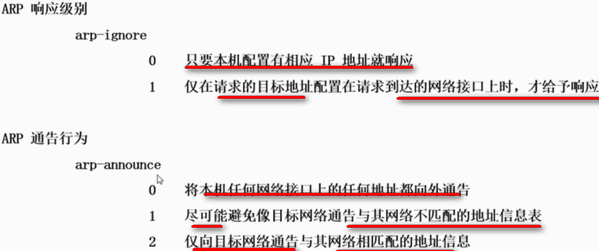
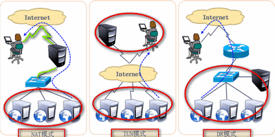
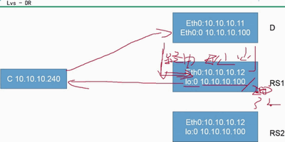
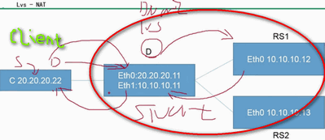
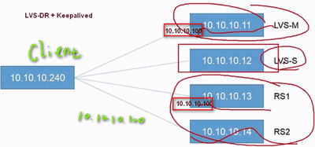
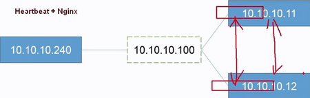

Linux 集群

##1.liunx集群概述：
###1.1集群概念：
>一组协同工作的服务器，对外表现为一个整体，更好的利用现有资源实现服务的高度可用  
###1.2集群的分类：
+ LBC：负载均衡集群
    - 减轻单台服务器的压力，将用户请求分担给多台主机一起处理
    - 实现方法：
        * 软件：LVS、RAC、Ngnix、
        * [LVS 管理工具指导](https://www.cnblogs.com/lipengxiang2009/p/7353373.html)
        * 硬件：F5、BIG-IP
+ HAC：高可用集群
    - 最大限度的保证用户的应用持久，不间断的提供服务
    - 实现原理：心跳检测
    - 实现方法：
        * 软件：heartbeat linux-HA、RHCS、ROSE、keepalived
        * 硬件：F5
+ HPC：高性能运算集群  

##2.负载均衡集群(LBC)
###2.1LVS 相关原理：
> LVS 运行在**系统内核空间**，用户空间无法直接管理，用**IPVSADM命令行工具**管理集群服务；根据用户请求的套接字判断，分流至真实服务器的工作模块
###2.2LVS工作模式：
+ NAT ✔
    - 模式特点：
        * 集群节点，必须在一个网络中；
        * 真实服务器网关必须指向负载调度器；
        * RIP通常都是私有IP，仅用于各个集群节点通信；
        * 负载调度器必须位于客户端和真实服务器之间，充当网关；
        * 支持端口映射，负载调度器操作系统必须是Linux ，真实服务器可以使用任意系统　　
+ DR ✔
    - 模式特点：
        * 集群节点，必须在一个网络中；
        * 真实服务器网关指向路由器；
        * RIP既可以是私网地址，又可以是公网地址
+ TUN
    - 模式特点
        * 集群节点不必位于同一个物理网络但必须都拥有公网IP（或都可以被路由）
        * 真实服务器不能将网管指向负载调度器
        * RIP必须是公网地址
        * 负载调度器只负责入站请求
        * 不支持端口映射功能
        * 发送方和接收方必须支持隧道功能  
        

###2.3LVS工作模式构建：
####2.3.1 DR 模式构建：  
+ 负载调度器配置  
`[root@xy ~]# service NetworkManager stop`  
`[root@xy ~]# vim /etc/sysconfig/network-scripts/`  
`[root@xy ~]# vim ifcfg-eth0:0`  拷贝eth0 网卡子接口充当集群入口接口  
DEVICE=eth0:0  
IPADDR=10.10.10.100 #虚拟IP  
NETMASK=255.255.255.0  
`[root@xy ~]# ifup eth0:0`  
`[root@xy ~]# vim /etc/sysctl.conf`  关闭网卡重定向  
net.ipv4.conf.all.send_redirects = 0  
net.ipv4.conf.default.send_redirects = 0  
net.ipv4.conf.eth0.send_redirects = 0  
`[root@xy ~]# sysctl -p`  
`[root@xy ~]# modprobe ip_vs` 重新加载 ipvs 模块  
`[root@xy ~]# rpm -ivh ipvsadm` 安装ipvsadm工具
`[root@xy ~]# ipvsadm -v` 查看当前集群内容  
`[root@xy ~]# ipvsadm -A -t 虚拟IP:80 -s rr` 添加 ipvs TCP 集群  
`[root@xy ~]# ipvsadm -a -t 虚拟IP:80 -r 网站1:80 -g` 添加 ipvsadm 集群子节点  
`[root@xy ~]# ipvsadm -a -t 虚拟IP:80 -r 网站2:80 -g`  
`[root@xy ~]# ipvsadm -Ln`  
`[root@xy ~]# service ipvsadm save`  
`[root@xy ~]# chkconfig ipvsadm on`  
+ 真实服务器  
`[root@xy ~]# service NetworkManager stop`  
`[root@xy ~]# cd /etc/sysconfig/network-scripts/`  
`[root@xy ~]# cp ifcfg-lo ifcfg-lo:0`  
`[root@xy ~]# vim ifcfg-lo:0`  拷贝回环网卡子接口  
DEVICE=lo:0  
IPADDR=虚拟IP  
NETMASK=255.255.255.255  
`[root@xy ~]# vim /etc/sysctl.conf` 关闭对应ARP 响应及公告功能  
net.ipv4.conf.all.arp_ignore = 1  
net.ipv4.conf.all.arp_announce = 2  
net.ipv4.conf.default.arp_ignore = 1  
net.ipv4.conf.default.arp_announce = 2  
net.ipv4.conf.lo.arp_ignore = 1  
net.ipv4.conf.lo.arp_announce = 2  
`[root@xy ~]# sysctl -p`  
`[root@xy ~]# ifup lo:0`  
`[root@xy ~]# route add -host 虚拟IP dev lo:0` 添加路由记录，当访问VIP 交给lo:0 网卡接受  
`[root@xy ~]# echo "route add -host 虚拟IP dev lo:0" >> /etc/rc.local` 加入到开机自启中
`[root@xy ~]# service httpd start`  
  

####2.3.2 NAT 模式构建：  
+ 负载调度器配置  
`[root@xy ~]# vim /etc/sysctl.conf`  开启负载调度器路由转发功能  
net.ipv4.ip_forward=1  
`[root@xy ~]# sysctl -p`  刷新内核参数  
`[root@xy ~]# service iptables start` 开启防火墙  
`[root@xy ~]# chkconfig iptables on`    
`[root@xy ~]# iptables -F` 清空防火墙默认规则  
`[root@xy ~]# iptables -t nat -A POSTROUTING -s 内网网段 -o eth0 -j SNAT -to-source 外网卡地址` 
`[root@xy ~]# iptables -t nat -L`  
`[root@xy ~]# ipvsadm -A -t 外网卡地址:80 -s rr`  添加 ipvsadm TCP 集群    
`[root@xy ~]# iptables -a -t 外网卡地址:80 -r 内网卡地址:80 -m` 添加 ipvsadm 节点    -m NAT 模式
`[root@xy ~]# ipvsadm -Ln`  
`[root@xy ~]# service ipvsadm save`  
`[root@xy ~]# chkconfig ipvsadm on`  

`[root@xy ~]# ipvsadm -Ln --status` 查看集群状态
`[root@xy ~]# ipvsadm -D -t 外网卡地址:80`  删除集群
+ 真实服务器配置  
`[root@xy ~]# route add default gw IP`  指定真实服务器网关至负载调度器  
`[root@xy ~]# route -n`  
`[root@xy ~]# service httpd start`  
`[root@xy ~]# chkconfig httpd on`  

##3.集群通用算法
###3.1静态调度算法：
+ **RR** 轮询算法：第一台服务器开始到N台结束，然后循环
+ **WRR** 加权算法：按权重比例实现多台主机之间进行调度
+ **SH** 源地址散列：将同一个IP用户请求，发送给同一个服务器
+ **DH** 目标地址散列：将同一个目标地址的用户请求发送给通一个真实服务器(提高缓存服务率)
###3.2动态调度算法：
+ **LC**：Lest-connection，最少连接，将新的连接请求，分配给连接数最少的服务器
    - 活动连接*256 + 非活动连接
+ **WLC**：加权最少连接，特殊的LC算法，权重越大承担请求越多
    - （活动连接*256 + 非活动连接）/ 权重
+ **SED**：最短期望延迟，特殊的WLC算法
    - （活动连接 + 1）*256 / 权重
+ **NQ**：无需等待，特殊的SED算法，若有正是服务器的连接数等于0就直接分配不需要运算  
+ **LBLC**：特殊的DH算法，即提高缓存命中率，有考虑了服务器性能
+ **LBLCR**：LBLC+缓存，尽可能提高负载均衡和缓存命中率折中方案
###3.3持久化连接(类似于SH优先级最高)
+ **PCC**：持久客户端连接
    - 将来自于同一个客户端的所有请求统统定向此前选定的RS，只要IP相同，分配的服务器始终相同
+ **PPC**：持久端口连接
    - 将来自于同一个客户端对同一个服务(端口)的请求，始终定向此前选定的RS
+ **PMFC**：持久防火墙标记连接
    - 将来自同一个客户端指定服务(端口)的请求，始终定向至此选定的RS，不过它可以将2个不相关的端口定义为一个集群服务
##3.高可用集群(HAC)
###3.1Keeplived原理：
+ 热备方式：VRRP 虚拟路由冗余协议
    - 一主+多备，共用同一个IP，但优先级不同
    - 支持故障自动切换
    - 支持节点健康状态检查  
###3.2LVS-DR+Keeplived：
  
`[root@xy ~]# service NetworkManager stop`  
`[root@xy ~]# chkconfig NetworkManager off`  
`[root@xy ~]# cd /etc/sysconfig/network-scripts/`  
`[root@xy ~]# cp -a ifcfg-eth0 ifcfg-eth0:0`  
`[root@xy ~]# vim !$`  
DEVICE=eth0:0    
IPADDR=10.10.10.100 #虚拟IP    
NETMASK=255.255.255.0   
`[root@xy ~]# ifup eth0:0`  
`[root@xy ~]# yum install -y ipvsadm`  
`[root@xy ~]# vim /etc/sysctl.conf`  关闭网卡的广播功能，防止冲突  
net.ipv4.conf.all.send_redirects = 0  
net.ipv4.conf.default.send_redirects = 0  
net.ipv4.conf.eth0.send_redirects = 0  
`[root@xy ~]# sysctl -p`  
`[root@xy ~]# ipvsadm -A -t 10.10.10.100:80 -s rr`  添加集群  
`[root@xy ~]# ipvsadm -a -t 10.10.10.100:80 -r 10.10.10.13:80 -g` 添加集群子节点，-g DR模式  
`[root@xy ~]# ipvsadm -a -t 10.10.10.100:80 -r 10.10.10.114:80 -g`  
`[root@xy ~]# service ipvsadm save`  
`[root@xy ~]# ipvsadm -Ln`  

    IP Virtual Server version 1.2.1 (siza=4096)  
    Port LocalAddress:Port Scheduler Flags 
        -> RemoteAddress:Port       Forward     Weight      ActiveConn      InActConn  
    TCP 10.10.10.100:80 rr
        ->10.10.10.13:80            Route       1           0           0
        ->10.10.10.14:80            Route       1           0           0  

`[root@xy ~]# service httpd start`  真实服务器开启Web服务  
`[root@xy ~]# chkconfig httpd on`  
`[root@xy ~]# echo "this is Server 1" >> /var/www/index.html`  10.10.10.13 
`[root@xy ~]# curl localhost`   
`[root@xy ~]# cd /etc/sysconfig/network-scripts/`  
`[root@xy ~]# cp ifcfg-lo ifcfg-lo:0`  
`[root@xy ~]# vim ifcfg-lo:0`  拷贝回环网卡子接口  
DEVICE=lo:0  
IPADDR=10.10.10.100    
NETMASK=255.255.255.255  
`[root@xy ~]# vim /etc/sysctl.conf` 关闭对应ARP 响应及公告功能  
net.ipv4.conf.all.arp_ignore = 1  
net.ipv4.conf.all.arp_announce = 2  
net.ipv4.conf.default.arp_ignore = 1  
net.ipv4.conf.default.arp_announce = 2  
net.ipv4.conf.lo.arp_ignore = 1  
net.ipv4.conf.lo.arp_announce = 2  
`[root@xy ~]# sysctl -p`  
`[root@xy ~]# ifup lo: 0`  
`[root@xy ~]# route add -host 10.10.10.100 dev lo:0` 添加路由记录，当访问VIP 交给lo:0 网卡接受  
`[root@xy ~]# echo "route add -host 10.10.10.100 dev lo:0" >> /etc/rc.local` 加入到开机自启中
`[root@xy ~]# ipvsadm -Ln --stats`  

    IP Virtual Server version 1.2.1 (siza=4096)  
    Port LocalAddress:Port   
        -> RemoteAddress:Port       Conns       InPkts      OutPkts     InBytes     OutBytes       
    TCP 10.10.10.100:80             16          79          0           11036          0
        ->10.10.10.13:80            8           39          0           5481           0
        ->10.10.10.14:80            8           40          0           5555           0   

`[root@xy ~]# mkdir /mnt/keepalived`      10.10.10.11  
`[root@xy ~]# mount -o loop Keepalived.iso`  
`[root@xy ~]# cp -a /mnt/leepalived/* .`  
`[root@xy ~]# vim /etc/keepalived/keepalived.conf`   

`[root@xy network-scripts]# cp -a ifcfg-eth0 ifcfg-eth0:0`   10.10.10.12  
DEVICE=eth0:0  
IPADDR=10.10.10.100  
NETMASK=255.255.255.0  
`[root@xy network-scripts]# vim ifup-eth`  256行左右，注释arp命令  
`[root@xy network-scripts]# ifup eth0:0`  
###3.3Heartbeat+Nginx：
  
`[root@xy ~]# yum -y install pcre pcre-devel zlib zlib-devel`  10.10.10.11  
`[root@xy nginx-1.2.6]# useradd -s /sbin/no-login -M nginx`  -M 家目录  
`[root@xy nginx-1.2.6]# ./configure --prefix=/usr/local/nginx --user=nginx --group=nginx`  
`[root@xy nginx-1.2.6]# make && make install`    

`[root@xy ~]# tar -xzvf heartbeat.tar.gz`  
`[root@xy heartbeat]# yum -y install ntp`  安装时间同步服务程序  
`[root@xy heartbeat]# vim /ect/ntp.conf` 
server 127.127.1.0  
fudge 127.127.1.0 st

