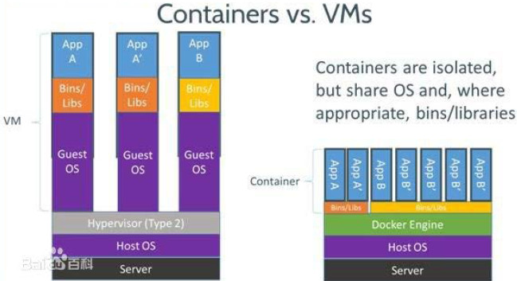

#docker  
  
##什么是docker?
###**Docker** 是一个**开源**的应用**容器引擎**，基于Go，Docker 使用客户端-服务器 (C/S) 架构模式，使用远程API来管理和创建Docker容器。Docker 容器通过 Docker 镜像来创建。
###容器是解决从一个计算环境移动到另一个计算环境时如何使软件可靠运行的问题的解决方案。这可以是从开发人员的笔记本电脑到测试环境，从临时环境到生产，从数据中心的物理机器到私有云或公共云中的虚拟机。
###一个容器包含了完整的运行时环境：一个应用、这个应用所需的全部依赖、类库、其他二进制文件、配置文件，它们统一被打入了一个包中。通过将应用平台和其依赖容器化，操作系统发行版本和其他基础环境造成的差异，都被抽象掉了。

##虚拟化和容器有什么不同？
###传统虚拟机技术是虚拟出一套硬件后，在其上运行一个完整操作系统，在该系统上再运行所需应用进程；而容器内的应用进程直接运行于宿主的内核，容器内没有自己的内核，而且也没有进行硬件虚拟。因此容器要比传统虚拟机更为轻便。

#docker三个基本概念：
+ 镜像(image)：镜像采用**分层存储**，并不是传统的ISO打包，实际上是由多层文件系统联合组成。镜像构建时，会一层层构建，前一层是后一层的基础。每一层构建完就不会再发生改变后一层上的任何改变只发生在自己这一层。因此每一层尽量只包含该层需要添加的东西，任何额外的东西应该在该层构建结束前清理掉。
+ 容器(container)：镜像（ Image ）和容器（ Container ）的关系，就像是面向对象程序设计中的 **类 和 实例**一样，镜像是静态的定义，容器是镜像运行时的实体。**容器可以被创建、启动、停止、删除、暂停等**。**容器的实质是进程**，但与直接在宿主执行的进程不同，**容器进程**运行于属于自己的独立的 **命名空间**。  
+ 仓库(repository)：Docker 仓库用来保存镜像，可以理解为代码控制中的代码仓库。分为公开与私有。

#docker安装：
+ Ubuntu：  
    `$ uname -r`    // 查看是否支持Docker

    >`$sudo apt-get remove docker \`      
    >   `docker-engine \`        
    >   `docker.io`  

    `$sudo apt-get update`  

    > `$sudo apt-get install \`  
    >`apt-transport-https \`  
    >`ca-certificates \`  
    >`curl \`  
    >`software-properties-commom`  

    `$ curl -fsSL https://mirrors.ustc.edu.cn/docker-ce/linux/ubuntu/gpg | sudo apt-key add -`

    >`$ sudo add-apt-repository \`
    >`"deb [arch=amd64] https://mirrors.ustc.edu.cn/docker-ce/linux/ubuntu \`  
    >  `$(lsb_release -cs) \`  
    >`stable"`  

    `$ sudo apt-get update`  
    `$ sudo apt-get install docker-ce` 
    `$ curl -fsSL get.docker.com -o get-docker.sh`     
    `$ sudo sh get-docker.sh --mirror Aliyun`  
    `$ sudo systemctl enable docker`
    `$ sudo systemctl start docker`
    `$ sudo service docker start`   // Ubuntu 14.04

    `$ sudo groupadd docker`  
    `$ sudo usermod -aG docker $USER`  
#使用镜像：
+ 获取镜像：`docker pull` 
- `docker pull [选项] [Docker Registry 地址[:端口号]/]仓库名[:标签]`

        $ docker pull ubuntu:16.04      // 获取镜像
        16.04: Pulling from library/ubuntu
        bf5d46315322: Pull complete
        9f13e0ac480c: Pull complete
        e8988b5b3097: Pull complete
        40af181810e7: Pull complete
        e6f7c7e5c03e: Pull complete
        Digest: sha256:147913621d9cdea08853f6ba9116c2e27a3ceffecf3b492983ae97c3d643fbbe
        Status: Downloaded newer image for ubuntu:16.04  
+ 有了镜像后，我们就能够以这个镜像为基础启动并运行一个容器：
        
        $ docker run -i -t --rm \         // -i 交互式   -t 终端
        ubuntu:16.04 \  
        bash  
        root@e7009c6ce357:/# cat /etc/os-release    // 7009 容器名称
        NAME="Ubuntu"
        VERSION="16.04.4 LTS, Trusty Tahr"
        ID=ubuntu
        ID_LIKE=debian
        PRETTY_NAME="Ubuntu 16.04.4 LTS"
        VERSION_ID="16.04"
        HOME_URL="http://www.ubuntu.com/"
        SUPPORT_URL="http://help.ubuntu.com/"
        BUG_REPORT_URL="http://bugs.launchpad.net/ubuntu/"
+ 列出镜像：`docker image ls`
  
        $ docker image ls
        REPOSITORY      TAG     IMAGE ID        CREATED     SIZE
        redis           latest  5f515359c7f8    5 days ago  183 M
        B
        nginx           latest  05a60462f8ba    5 days ago  181 M
        B
        mongo           3.2     fe9198c04d62    5 days ago  342 M
        B
        <none>          <none>  00285df0df87    5 days ago  342 M
        B   // 虚悬镜像
        ubuntu          16.04   f753707788c5    4 weeks ago 127 M
        B
        ubuntu          latest  f753707788c5    4 weeks ago 127 M
        B
        ubuntu          14.04   1e0c3dd64ccd    4 weeks ago 188 M

        $ docker image ls -f dangling=true    // 查询虚悬镜像
        $ docker image prune    // 删除虚悬镜像

        $ docker image ls --format "table {{.ID}}\t{{.Repository}}\t{{.Tag}}"
        IMAGE ID        REPOSITORY      TAG
        5f515359c7f8    redis           latest
        05a60462f8ba    nginx           latest
        fe9198c04d62    mongo           3.2
        00285df0df87    <none>          <none>
        f753707788c5    ubuntu          16.04
        f753707788c5    ubuntu          latest
        1e0c3dd64ccd    ubuntu          14.04
+ 删除本地镜像：`docker image rm`
- `$ docker image rm [选项] <镜像1> [<镜像2> ...]`  
    
        $ docker image rm 501
        Untagged: redis:alpine
        Untagged: redis@sha256:f1ed3708f538b537eb9c2a7dd50dc90a706f7debd7e1196c9264edeea521a86d
        Deleted: sha256:501ad78535f015d88872e13fa87a828425117e3d28075d0c117932b05bf189b7
        Deleted: sha256:96167737e29ca8e9d74982ef2a0dda76ed7b430da55e321c071f0dbff8c2899b
        Deleted: sha256:32770d1dcf835f192cafd6b9263b7b597a1778a403a109e2cc2ee866f74adf23
        Deleted: sha256:127227698ad74a5846ff5153475e03439d96d4b1c7f2a449c7a826ef74a2d2fa
        Deleted: sha256:1333ecc582459bac54e1437335c0816bc17634e131ea0cc48daa27d32c75eab3
        Deleted: sha256:4fc455b921edf9c4aea207c51ab39b10b06540c8b4825ba57b3feed1668fa7c7
+ `Untagged` 和 `Deleted`：  
因为一个**镜像可以对应多个标签**，因此当我们删除了所指定的标签后，可能还有别的标签指向了这个镜像，如果是这种情况，那么 Delete 行为就不会发生。当该镜像所有的标签都被取消了，该镜像很可能会失去了存在的意义，因此会触发删除行为。容器是以镜像为基础，再加一层容器存储层，组成这样的多层存储结构去运行的。因此该镜像如果被这个容器所依赖的，那么删除必然会导致故障。如果这些容器是不需要的，应该先将它们删除，然后再来删除镜像。

+ 利用 `docker commit`理解镜像构成  
- `docker commit [选项] <容器ID或容器名> [<仓库名>[:<标签>]]`  
**镜像是多层存储，每一层是在前一层的基础上进行的修改；而容器同样也是多层存储，是在以镜像为基础层，在其基础上加一层作为容器运行时的存储层。commit导致镜像极为臃肿,docker commit 意味着所有对镜像的操作都是黑箱操作，生成的镜像也被称为黑箱镜像**

        $ docker run --name webserver -d -p 80:80 nginx 

        $ docker exec -i -t webserver bash
        root@3729b97e8226:/# echo '<h1>Hello, Docker!</h1>' > /usr/share/nginx/html/index.html
        root@3729b97e8226:/# exit
        exit
        $ docker commit \
        --author "Tao Wang <twang2218@gmail.com>" \
        --message "修改了默认网页" \
        webserver \
        nginx:v2
        sha256:07e33465974800ce65751acc279adc6ed2dc5ed4e0838f8b86f0c87aa1795214
+ 使用 `Dockerfile` 定制镜像：
**Dockerfile 支持 Shell 类的行尾添加 `\ `的命令换行方式，以及行首 `#` 进行注释的格式。**

        FROM debian:jessie      // Dockerfiel 文件示例
        RUN buildDeps='gcc libc6-dev make' \
        && apt-get update \
        && apt-get install -y $buildDeps \
        && wget -O redis.tar.gz "http://download.redis.io/releases/redis-3.2.5.tar.gz" \
        && mkdir -p /usr/src/redis \
        && tar -xzf redis.tar.gz -C /usr/src/redis --strip-components=1 \
        && make -C /usr/src/redis \
        && make -C /usr/src/redis install \
        && rm -rf /var/lib/apt/lists/* \
        && rm redis.tar.gz \
        && rm -r /usr/src/redis \
        && apt-get purge -y --auto-remove $buildDeps

        $ docker build -t nginx:v3 .
        Sending build context to Docker daemon 2.048 kB
        Step 1 : FROM nginx
        ---> e43d811ce2f4
        Step 2 : RUN echo '<h1>Hello, Docker!</h1>' > /usr/share/nginx/html/index.html
        ---> Running in 9cdc27646c7b
        ---> 44aa4490ce2c
        Removing intermediate container 9cdc27646c7b
        Successfully built 44aa4490ce2c
#操作容器：
+ 启动容器：

        $ docker run ubuntu:14.04 /bin/echo 'Hello world'
        Hello world

        $ docker run -t -i ubuntu:14.04 /bin/bash
        root@af8bae53bdd3:/#

        root@af8bae53bdd3:/# ls
        bin boot dev etc home lib lib64 media mnt opt proc root run sbin srv sys tmp usr var
+ 后台运行：
**注： 容器是否会长久运行，是和 docker run 指定的命令有关，和 -d 参数无关。**
使用 `-d` 参数启动后会返回一个唯一的 id，也可以通过 `docker container ls` 命令来查看容器信息。

        $ docker run ubuntu:17.10 /bin/sh -c "while true; do echo hello world; sleep 1; done"
        hello world
        hello world
        hello world
        hello world

        $ docker run -d ubuntu:17.10 /bin/sh -c "while true; do echo hello world; sleep 1; done"    //  后台运行
        77b2dc01fe0f3f1265df143181e7b9af5e05279a884f4776ee75350ea9d8017a

        $ docker container ls      // 查看容器信息
        CONTAINER ID    IMAGE       COMMAND                 CREATED         STATUS  PORTS NA
        MES
        77b2dc01fe0f    ubuntu:17.10 /bin/sh -c 'while tr   2 minutes ago   Up      1 minute agitated_wright

        $ docker container logs [container ID or NAMES]     // 获取容器的输出信息
        hello world
        hello world
        hello world\
+ 终止容器：

        docker container stop   // 终止一个运行中的容器
        docker container ls -a
        docker container start  // 命令来重新启动。
        docker container restart    

+ 进入容器：
-  `docker attach`   `docker exec   推荐后者`

        $ docker run -dit ubuntu
        243c32535da7d142fb0e6df616a3c3ada0b8ab417937c853a9e1c251f499f550
        $ docker container ls
        CONTAINER ID IMAGE COMMAND CREATED STATUS
        PORTS NAMES
        243c32535da7 ubuntu:latest "/bin/bash" 18 seconds ago Up 17
        seconds nostalgic_hypatia
        $ docker attach 243c
        root@243c32535da7:/#  
        注意： 如果从这个 stdin 中 exit，会导致容器的停止。

        $ docker run -d -i -t ubuntu
        69d137adef7a8a689cbcb059e94da5489d3cddd240ff675c640c8d96e84fe1f6
        $ docker container ls
        CONTAINER ID    IMAGE           COMMAND     CREATED         STATUSPORTS     NAMES
        69d137adef7a    ubuntu:latest " /bin/bash"  18 seconds ago  Up              17seconds zealous_swirles
        $ docker exec -i 69d1 bash
        ls
        bin
        boot
        dev
        ...
        $ docker exec -i -t 69d1
        root@69d137adef7a:/#
+ 导出和导入容器：
        
        $ docker ps -a            
        CONTAINER ID        IMAGE            COMMAND    CREATED          STATUSPORTS   NAMES
        7691a814370e        ubuntu:14.04    "/bin/bash"     36 hours ago Exited(0)     21 hours ago test
        $ docker export 7691a814370e > ubuntu.tar         // 导出容器

        $ cat ubuntu.tar | docker import - test/ubuntu:v1.0     // 导入容器
        $ docker image ls
        REPOSITORY  TAG                 IMAGE ID            CREATED            VIRTU
        AL SIZE     test/ubuntu v1.0    9d37a6082e97        About a minute ago 171.3MB

        $ docker import http://example.com/exampleimage.tgz example/imagerepo